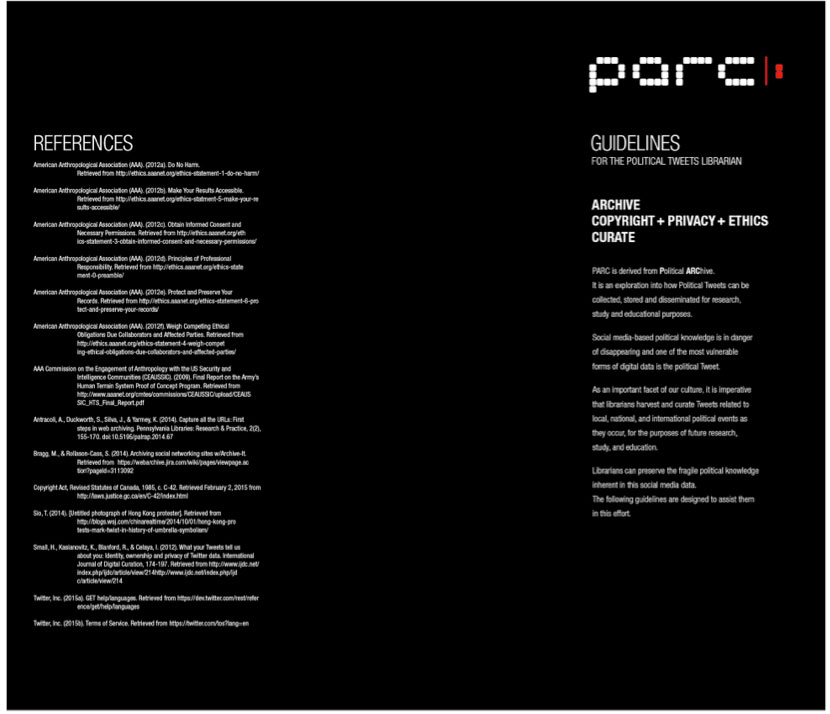
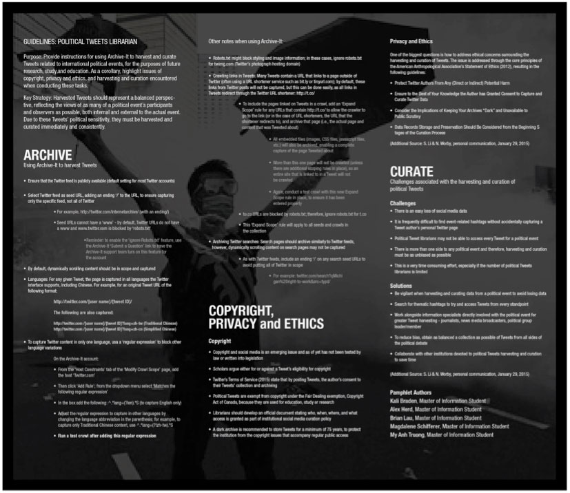
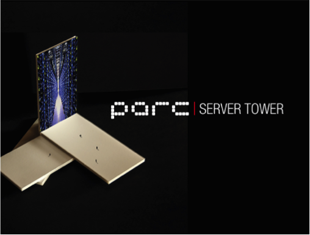

<link rel="stylesheet" href="https://maxcdn.bootstrapcdn.com/font-awesome/4.6.1/css/font-awesome.min.css">

<a class="js-modal" data-modal-prefix-class="simple-animated" data-modal-content-id="endorsement" data-modal-title="Faculty Endorsement" data-modal-close-text="Close" data-modal-close-title="Close this modal window">Endorsed by Bobby Glushko, Head of Scholarly Communications and Copyright <i class="fa fa-external-link-square" aria-hidden="true"></i></a>

<em>from Bobby Glushko, Head of Scholarly Communications and Copyright,  University of Toronto Libraries</em>

I’m proud to endorse this paper for The iSchool Review.  I think that this work makes a significant contribution to an emerging area of librarianship and is relevant to the iSchool movement.  Having seen this effort evolve since its conception, I am impressed with the direction in which the authors have undertaken their research and I think that their methods, framework, and conclusions are solid.  Web archiving is an active and expanding practice in libraries, and much of it is being done without the proper policy analysis set in place.  In the CHI and CSCW literature, there has been an increased focus on policy, and this paper resonates with this emerging disciplinary trend.

In the past half-decade, various individuals and groups have begun to record social media data from a variety of public events across the world, in particular political occurrences that have engaged a wide spectrum of insiders and outsiders. Contemporary information specialists are among those who seek to preserve this data, recognizing its importance for the historical record as representative of how early-21st century humans communicate and associated cultural norms, dialogue, trends and events (Scola, 2015). Moreover, collected data can serve numerous educational uses, now and in the future. There is no single method for this emerging task in the information field. This article suggests one approach, encompassed in a series of instructional guidelines (Figure 1.1 and Figure 1.2) aimed at assisting those archivists, librarians, and other information specialists tasked with harvesting and curating one form of social media data - Tweets - from international political events. These guidelines address the copyright, ethical, and task-related issues involved in the harvesting and curation of political Tweets.

__Figure 1.1__

__Figure 1.2__

The role of the Political Tweets Librarian is also proposed. As the primary employer of the guidelines, this individual is envisioned as an academic librarian; but, the guidelines’ principles are applicable to other information specialists working at public libraries and nonprofit organizations. This article also conceptualizes the related Political ARChive (PARC), an institution devoted to recording the “political voices” reflected in Tweets. At the PARC, Political Tweets Librarians collect, record, and preserve Tweets and hashtags from political events all over the world.

<iframe width="560" height="315" src="https://www.youtube.com/embed/GRfn8buN75o" frameborder="0" allowfullscreen></iframe>

##Twitter and International Political Events

Tweets are the products of the online social media platform Twitter, the “expression of a moment or idea” that “can contain text, photos, and videos.” Users assign topics to Tweets by adding hashtags; these hashtags represent a form of organization of Tweets, by which other users can locate Tweets on the assigned topic. As stated on Twitter.com, “Tweets that contain #WorldCup are about just that. Click on a hashtag to see Tweets related to a topic” (Twitter, Inc., 2015c). One major result of this social media platform’s widespread use is that “Twitter has become the Internet’s de facto public forum” (Zimmer, 2015). The choice to focus on Twitter/Tweets, rather than other social media platforms such as Facebook, Instagram, or Snapchat (arguably just as efficient means to transmit event-related data as Tweets), is rooted in the virtual ubiquity of Tweets during public and politically charged events, and the resultant widespread creation of hashtags related to these happenings. Two recent examples are the Ukraine-Russia conflict and the aftermath of journalist shootings in France in January 2015.

The role of the Political Tweets Librarian and the associated instructional guidelines derive from information specialists’ efforts to capture social media data as part of the historical record of these international events and others, because such data is ephemeral in nature, due to its digital status and political dimensions. Arguably, the collection of social media data after the 2011 Arab Spring set the stage for the importance of contemporary efforts to preserve Tweets, which otherwise could be deleted by authorities because of political sensitivities (Dougherty, 2011). Another example is the pro-democracy protests in Hong Kong in late 2014, which began after the Chinese government ruled against fully open elections in 2017 (BBC News, 2014). Librarians at the University of Toronto have previously harvested social media data from the Hong Kong protests, and the guidelines were initially designed to assist their efforts in which they used the online archiving service Archive-It.

##Archive-It

Librarians’ recent recognition of the increasing importance of harvesting and curating social media data is linked to general efforts to archive websites.  This is because digital documentation is easily lost, if not properly preserved and maintained. Many librarians prefer using the Internet Archive’s subscription service Archive-It (Archive-It, 2015), which captures seed URLs, crawls these sites on periodic bases (set by the user), and provides users the ability to curate and quality control their own content (Antracoli, Duckworth, Silva, & Yarmey, 2014, pp. 159-160). Archived websites are publicly available through the Wayback Machine (Internet Archive, 2015). Additionally, librarians attest to Archive-It staff’s excellent customer service and willingness to meet user needs (Antracoli et al., 2014; S. Li & N. Worby, personal communication, January 29, 2015; Luyk & Sherbaniuk, 2015). For the purposes of Tweet archiving, Archive-It enables users to block personal Twitter profile pages.  This means that users can isolate Tweets related thematically and via hashtags without encroaching on their authors’ privacy. The Political Tweets Librarian guidelines reflect two main assumptions: first, that the Political Tweets Librarian has the necessary institutional funds to pay for Archive-It’s subscription; and secondly, that this librarian knows how to use Archive-It to archive conventional websites through the institutional account. The guidelines’ steps to use Archive-It to harvest and curate Tweets are based on the instructions written by Bragg and Rollason-Cass (2014).

##Copyright Issues

Important issues of copyright are involved in the harvesting and curation of political Tweets, which can ensure that valuable information and perspectives on political events endure. The issues of copyright and ownership are related to the push by libraries to archive publicly available web content to prevent its easy loss, an initiative recommended by a U.S. Library of Congress study group (Antracoli et al., 2014). Elements regarding the copyright and ownership of Tweets are integrated into the guidelines for the Political Tweets Librarian. These elements represent recommendations and, in the creation of policies for the harvesting and curation of political Tweets, different librarians and institutions can modify them according to local needs. However, the harvesting, archiving, and curation of social media, particularly Tweets, is a new issue and their copyright and ownership dimensions have yet to be tested in court (Small, Kasianovitz, Blanford, & Celaya, 2012).

Scholars debate the copyright and ownership issues related to Twitter and Tweets. Some contend that users who choose to make their Twitter accounts public cannot object to the reuse or collection of their Tweets, because users have the option to privatize their account.  At the same time, if a Twitter user’s content is indeed utilized – for example, for a research project or media report – the user may view Tweets as a means for personal expression and therefore may wish to be credited for this expression (Small et al., 2012). Meanwhile, there are three arguments against Tweets as copyrighted material applicable both in Canada and the United States: small size, the content they contain, and the similarities between them (Reinberg, 2009).

First, the short length of one hundred and forty characters makes Tweets possibly ineligible for copyright protection (Reinberg, 2009; Small et al., 2012). In addition, much of what is posted on Twitter is the statement of common-knowledge facts or the impression of these facts, which are not copyrightable. Furthermore, for example, when a hundred individuals Tweet on a similar situation, many comments are written in a similar manner, making copyright difficult to discern. Scholars who argue for Tweets as copyrightable believe that some Tweets represent originality, as defined under copyright, or that a collection of Tweets as a whole potentially meets the minimum necessary for copyright protection (Reinberg, 2009).

Regardless of the views on copyright and ownership, both are circumventable by the Twitter Terms of Service and/or the Fair Dealing exemption of copyright law in Canada. According to Twitter’s Terms of Service, posting Tweets grants Twitter “a worldwide, non-exclusive, royalty-free license (with the right to sublicense) to use, copy, reproduce, process, adapt, modify, publish, transmit, display and distribute such Content in any and all media or distribution methods (now known or later developed)” (Twitter, Inc., 2016b). By this standard, Twitter owns every Tweet, but public Tweets are also useable for educational means. Canada’s Copyright Act (1985) states, “For greater certainty, the exceptions to infringement of copyright provided for under sections 29.4 to 30.3 and 45 also apply in respect of a library, archive or museum that forms part of an educational institution.” According to Taylor (2014), “Fair dealing is a user’s right in copyright law permitting use of, or ‘dealing’ with, a copyright protected work without permission or payment of copyright royalties.” Under Canada’s Copyright Act’s Fair Dealing exception, an individual is able to use copyrighted material for research, private study, education, satire, parody, criticism, review, or news reporting. Through the Political Tweets Librarian, academic libraries can harvest publicly available Tweets and their use for research, study, and other educational purposes falls clearly under the Fair Dealing exception of Canadian copyright law. 

For Political Tweets Librarians to ensure fair dealing, careful steps are recommended in the development of a Tweets curation policy. Antracoli et al. (2014) recommend that institutional policy clearly outline who, when, and what level of access is granted to researchers (pp. 163). One legitimate possibility is keeping the Tweets in a “dark archive” accessible only to specific faculty, students, and other researchers after they have signed a user agreement. The institution thereby avoids the common copyright issues that accompany regular public access. The user agreement would emphasize that the use of archive information is only for research, study, and other educational purposes, and restricted to onsite access. Many libraries, such as the National Library of France, have dark Web archives with access restricted to onsite only (S. Li & N. Worby, personal communication, January 29, 2015). In addition, the Finnish Web Archive, the Web Archive of Norway, and the Web Archive of Switzerland are also kept dark with onsite access only (Jinfang, 2012). In order to account for the multitude of Tweet authors composing a curated Tweet collection, it is recommended that these Tweets are maintained in a dark archive for a minimum of seventy-five years, which is the same length that copyright protection is afforded to anonymous Canadian authors from the date of creation (Copyright Act, 1985).

##Privacy and Ethical Guidelines

For the Political Tweets Librarian, one of the biggest questions is how to address the ethical concerns surrounding Twitter author data, and the capture and storage of Tweets. Included in the Political Tweets Librarian guidelines are a subset of privacy and ethical recommendations to assist with the daily dealings associated with the harvesting and curation of Tweets. For this subset of guidelines, resources of the American Anthropological Association (AAA) were consulted, with the organization’s Statement of Ethics chosen as the primary set of standards to create an ethical framework for Political Tweets Librarians to assist them in their duties. The AAA Statement of Ethics provides a set of “core principles that are expressed as concise statements”, all of which are simple, easy to remember, and can be put into practice in everyday life (AAA, 2012d). The intent of these privacy and ethical guidelines is to provide Political Tweets Librarians  (and anthropologists) with a foundation for the entire lifespan of their projects, making it clear that they must “deliberately weigh the consequences and ethical dimensions of the choices they make” (AAA, 2012d).

As in any profession guided by ethical standards, and because Tweet harvesting and curation is an emerging field, the four broad privacy and ethical guidelines in the Political Tweets Librarian guidelines are,,subject to continuous revisiting and likely revision. The privacy and ethical guidelines are not designed as a precise set of instructions to follow, but rather as a tool to provoke thought about potential harm to Twitter authors, the process of Tweet curation, and how Twitter data is stored; the guidelines also build on the aforementioned discussion of who can access the archived data and the length of time for data storage. The full details of the privacy and ethical guidelines are explained below.
 
###1. Protect Twitter Authors From Any (Direct and Indirect) Potential Harm

The first ethical guideline is highly important in guiding the Political Tweets Librarian’s practice of Tweet harvesting and curation. Drawing from the AAA Statement of Ethics, the “primary ethical obligation” of librarians curating social media is to “do no harm” to Tweet authors and to “weigh carefully the potential consequences and inadvertent impacts of their work” (AAA, 2012a). As a direct or indirect result of the inclusion of the author’s Tweet and/or personal data (e.g. profile data, Tweet ID, location data, viewing history) in the library database, Political Tweets Librarians must weigh their library’s social media curation needs against any potential harm to a Twitter author (Small et al., 2012). Although there is a push within the social media archiving community to collect as much Twitter data as possible while a political protest or uprising occurs, in an attempt to ensure that the data is not lost (SalahEldeen & Nelson, 2012; S. Li & N. Worby, personal communication, January 29, 2015), Political Tweets Librarians should feel empowered to stop the curation process at any point if they are concerned that the needs of the library and potential harm to the Twitter author are in conflict.

The AAA guidelines suggest giving special consideration to the protection of “vulnerable populations” (AAA, 2012f). Political Tweets Librarians are trained to pay extra attention when harvesting and curating political protesters’ Tweets, because it is important that these Tweet authors’ opposition does not use their account data as a means for identification and oppression. However, there may be exceptions in legal cases. One example of Twitter data used to prosecute a Tweet author was the conviction of Occupy Wall Street protester Malcolm Harris. In September 2012, Judge Matthew A. Sciarrino, Jr. ordered Twitter to hand over Mr. Harris’ archived Tweets from the 2011 protests. This resulted in a “disorderly conduct” conviction in December 2012 (Buettner, 2012; Zetter, 2012). Although in this example a library was not asked to release Tweet data, the Political Tweets Librarian should always consider the possibility that they will be asked to release such information under court order.

In addition, it is also important to take into consideration any harm that might arise from the cultural appropriation of Twitter data by the library. Harm may be caused to the author if the Tweet is not displayed in an appropriate cultural context. The same is true if the display is inauthentic or “distorted”, which would potentially result in the discrimination and harm of group members (Young & Brunk, 2009, pp. 9).
 
###2. Ensure to the Best of Your Knowledge the Author has Granted Consent to Capture and Curate Twitter Data

It is important that Political Tweets Librarians have, to the best of their knowledge, the Tweet author’s consent to harvest, capture, and curate their data for potential research purposes. Similar to copyright issues, there is an ongoing debate over whether Tweets and/or the author’s personal data are considered private or public information. As a result, Tweets’ capture and curation remain a grey area in terms of consent.

If Twitter’s Terms of Service (2016b) are used as a guideline, a Tweet author potentially grants “informed consent” for the capture and curation of publicly available data at the time of account activation.  This is because the Terms state that Tweets are “public by default” and will be “viewed by other users, through third party organizations, and websites” (AAA, 2012c; Twitter, Inc., 2016b). Although the Twitter Terms of Service do not mention the capture and curation of Twitter data for archival purposes, Twitter’s gift of its entire Tweet collection from 2006 to April 2010 to the U.S. Library of Congress indirectly suggests the acceptability of the practice (Allen, 2013; Twitter, Inc., 2010). On the other hand, although the content is likely to be publicly available, concern surrounds the capture and use of Tweets outside the “private” social context of the controlled access network of user “followers” in which they were created (Small et al., 2012). The Political Tweets Librarian must then consider the “quality of consent” and the intended audience of published Tweets.  Moreover, the Librarian should keep in mind that for both Twitter, Inc. and Tweet authors what constitutes consent is continuously changing (AAA, 2012c).
 
###3. Consider the Implications of Keeping Your Archives “Dark” and Unavailable to Public Scrutiny

In addition to Tweet copyright issues, as mentioned, libraries can create “dark archives” and they can serve to manage concerns surrounding the “do no harm” principle. The concern with dark archives is that it is possible that no one outside of select librarians, researchers, technical specialists and other designated users will have the opportunity to view and scrutinize archival content, which could make it difficult to determine the ethical dimensions of the archive’s creation, use, data organization methods, and stored content. An example of an archive that is not open to public scrutiny (because of security concerns) and that presents ethical challenges is the Human Terrain System database of Human Terrain Team field data collected from local Iraqi and Afghan populations for use by the United States military. Although the data is purported to only assist the military in gaining “socio-cultural” knowledge of the area, there is no proof that the information is stored securely within the database and not used for the “lethal targeting” of suspected insurgent groups (CEAUSSIC, 2009, pp. 4-32). There are genuine reasons for establishing a dark archive in terms of the “do no harm” principle, but opening them to internal and external critique can potentially ensure that curation practices are ethically sound (AAA, 2012b).
 
###4. Record Storage and Preservation Should Be Considered From the Beginning Stages of the Curation Process

At the beginning of a harvesting and curation project, it is important that the Political Tweets Librarian establish institution-wide policy to govern the entire life cycle of a Tweet (e.g. harvest, capture, curation and disposal) to ensure the security of archived data. In addition, Librarians also need to consider the privacy and security of the Twitter data collected and the protection of Tweet authors’ confidentiality. The Code of Ethics of the American Library Association (2008) only considers the library patron’s “right to privacy and confidentiality” (sect. III) , and does not currently address issues of privacy and security for curated Tweet authors. However, the AAA Statement of Ethics states that it is the researcher’s responsibility to “balance obligations to maintain data integrity with responsibilities to protect research participants … against future harmful impacts” (AAA, 2012e).
Another issue is the duplication and ease of copying Twitter data by potential researchers. As Twitter data is in digital format, the unauthorized downloading of Twitter data (e.g. by USB stick, e-mail), printing of paper copies, and/or use of cameras or screen-shots to the capture data from computer screens form a genuine concern. Will Librarians allow researchers to bring cameras, cell phones, or USB sticks into a dark archive? Furthermore, Political Tweets Librarians should also concern themselves with whether the database itself is secure from cyber attacks and ensure the trustworthiness of off-site repositories (including Archive-It) at which curated material is stored. With regard to accessing and releasing Twitter data to local authorities without the Political Tweets Librarian’s consent, the important ethical considerations for examination are the political laws and customs of the server host nation (S. Li & N. Worby, personal communication, January 29, 2015). 

The SWIFT case is one example of a backup archive stored on a server in a country other than the company’s host nation. SWIFT, a Belgium-based company specializing in finance, maintained two identical databases to store transactional information - one in Europe and one in the United States. While SWIFT’s European database was under the jurisdiction of Belgium’s Privacy Act of 1992, under the International Emergency Economic Powers Act of 1977, after the 11 September 2001 terrorist attacks on the United States, the company was legally compelled to provide access to the database located in the United States. The information breach was made public by the New York Times in June 2006, when an article revealed SWIFT “had been subject to a number of subpoenas requiring it to disclose messaging information to the U.S. Department of the Treasury” (Commission for the Protection of Privacy, 2016; International Emergency Economic Powers Act of 1977, 2014; Kuner, 2010; Van Overstraeten & Cumbley, 2009). 

##Harvesting and Curation Issues

As the Political Tweets Librarian harvests and curates political Tweets, there are several task-related issues to keep in mind, and these are listed in the guidelines. As online information proliferates at a fast rate, for the Political Tweets Librarian collecting social media, data can become overwhelming, especially with the aforementioned easy loss of social media data. According to Antracoli et al. (2014), nearly 11% of shared social media resources will be lost at some point.  Again, this issue is heightened from a political standpoint, for politically sensitive data (e.g. related to political protests) are even more susceptible to disappearance. Therefore, the Political Tweets Librarian must be vigilant when harvesting and curating data from a political event.
Another notable issue is that social media curating is currently very limited in terms of search specification. For example, unless something major occurred, such as Rob Ford dropping out of the race and his brother Doug Ford taking over, during the 2014 Toronto mayoral election, University of Toronto librarians searched for Tweets at least every three days,. That led to an increased frequency of crawls, and the University of Toronto librarians accidentally captured a Tweet author’s personal Twitter page (S. Li & N. Worby, personal communication, January 29, 2015). To avoid the issue of accidentally capturing an author’s information or other unwanted and/or private information, Political Tweets Librarians should search using thematic hashtags.

With this in mind, Librarians may not be able to access every Tweet regarding a given political event. A possible solution is for Political Tweets Librarians to work alongside information sources who they can publicly identify and thereby promptly provide appropriate hashtags related to specific political events. These individuals could be leaders or members of the political groups involved in the event, or more likely media representatives. Journalists and news broadcasters, for example, tend to have intimate knowledge of ongoing political events. While sharing their own knowledge of how and when to crawl Twitter feeds, Political Tweets Librarians collaborating with media members will benefit from being updated consistently with news.

There are two sides to every story and an issue associated with media collaboration is potential bias. To obtain a balanced political Tweets collection, Librarians must also crawl the web for all possible data about political events. They must look at all sides of a story, including collecting data from international authors (e.g. external to the political event’s participants). Achieving an appropriately balanced Tweets collection can be very time consuming, especially if there is a limited number of Librarians harvesting, curating, and archiving Tweets from political events. Not only do Political Tweets Librarians need to crawl the Web and Twitter at least every three days for hashtags about political events (Antracoli et al., 2014; S. Li & N. Worby, personal communication, January 29, 2015), but also they must collect data from every angle of the situation.

In order to save time, a proposed solution is for the Political Tweets Librarians to collaborate with other academic institutions, either internal or external. For example, Robarts Library at the University of Toronto relies primarily on two Librarians to crawl the Web for Tweets  relating to political events. To save time and effort and put fresh eyes on the subject, they have suggested that they could potentially reach out to other Tweet archivists from other institutions to help with curating and archiving Tweets from Hong Kong, for example. This situation would allow them to spend more time crawling the Web for other political events, rather than endlessly searching for possible hashtags and perspectives of the same political event (S. Li & N. Worby, personal communication, January 29, 2015). Lastly, it is possible that there may be limited information on how to search and curate specific social media. The guidelines provided will prepare future Political Tweets Librarian to harvest and curate Tweets.

## PARC

The Political ARChive (PARC) (Figure 2.1) is a conceptual library devoted to capturing and archiving political Tweets, as well as other types of politically relevant social media data. PARC’s mandate is to lead efforts in political Tweet archiving, curation, advocacy and research. To meet the demands of a political digital library and fulfill its mandate, PARC’s staff would include Political Tweets Librarians, digital archivists, copyright experts, ethics scholars and technology experts. The institution’s primary goal is to address issues surrounding the archiving of increasingly ephemeral political digital knowledge and the changing role of libraries in society.

__Figure 2.1__

As PARC’s concept extends from the Political Tweets Librarian guidelines, the institution embodies the imperative to organize political social media data in a digital archive and thereby create a physical space devoted to this endeavour. Such a dedicated library houses political Tweets with staff ensuring that copyright, privacy, and ethical curation practices are followed and providing expert guidance to educators and academic researchers. Having a physical structure to house political Tweets also provides a platform for immaterial digital knowledge to become “material”. PARC’s physicality is of special importance in an institution dedicated to political Tweets because politics demand expression, politics demand voice, voice gives it force, and force requires mass. PARC gives mass to what would otherwise be voiceless in its ephemerality.

Ephemerality is also encroaching on the institution of the library. With the significant shift to querying the Internet for information and knowledge, libraries are “relinquishing [their] place as the top source of inquiry” (Campbell, 2006, pp. 16) and becoming in a sense ephemeral, losing their physicality through irrelevance. This context questions the role of the “new” intangibles and their place within the “tangible” world of the library. Campbell (2006) states that there is a “need for a new mission” (pp. 20) and suggests that libraries can provide quality learning spaces, with librarians teaching digital information literacy (e.g. Twitter literacy), collecting and digitizing archival materials, and maintaining digital repositories - all of which are skills that require specific spatial organization. The development of PARC demonstrates how librarians can and should make the shaping of space a serious consideration of their practice.

Architecture as a spatial organization has been used to “embody knowledge” (Perez-Gomez, 1987, pp. 1) and, as such, librarians should consider embodying digital knowledge as a crucial part of their profession. Organized spaces can enchant, emplace, and enact (Griffs, 2013, pp. 2-3). When such spaces are made public, they can influence and shape public perception and behaviour (Lockton, 2011, pp. 14). Moreover, the “power of aesthetics” can improve learning (Kjaervang, 2006, pp. 1) and create associations and identities forged by shaping urban public spaces, thereby connecting this aestheticism to the democratic governance of the public sphere (Harvey, 2005, pp. 1).

PARC is an early exploration towards making Twitter political voices heard and the role of libraries and librarians visible in society again. This institution is conceptually structured for public relevance through several interfacing connections. PARC’s vertical structure is configured as a server tower (see Figure 2.2) to facilitate a digital repository for political Tweets (and potentially other digital political information). One core aspect of PARC is that it is connected via a digital network to other similar digital repositories around the globe, which allows researchers to access dark archives anywhere in the world via PARC’s secure computer facilities.

__Figure 2.2__

The server tower also generates heat, which is captured to provide a part, if not all, of the library’s electrical needs. PARC’s vertical structure is also envisioned to have skinned solar panels (see Figure 2.3) to generate more electricity. Excess electricity created by the solar panels can be fed directly into the city power grid, thus establishing connections with the people and spaces around it. The vertical structure will also feature a video wall (see Figure 2.4) that can live-broadcast or re-broadcast significant political events expressed via Twitter (see Figure 2.5), video, social media, or other digital platforms.

__Figure 2.3__

__Figure 2.4__

__Figure 2.5__

PARC’s vertical tower connects with a horizontal platform, which creates a physical space that the public can use to stage political protests, or digitally connect with other communal spaces to form a nexus of local or global political activity. This nexus provides an additional connection between PARC and the public. The inside of PARC’s horizontal platform is the library itself, which provides research space and facilities for the public. The conceptual Hall of Pillars connects to PARC’s digital archives and provides real-time interaction with Tweets, as well as with other political entities from around the world. Users have the option of viewing Twitter data on each pillar’s full-length video display for the immersive audio-visual experience, or through a directed audio cone that constrains sensitive information to the viewer only.

In addition to harvesting, archiving, storing, and providing access to curated political Tweets, other activities PARC and its staff might undertake to support its mandate include:

* Provide a forum for library and information science professionals, technology experts, legal scholars, ethics scholars, social media scholars, digital archivists, and museum and industry professionals by hosting workshops and annual conferences (Osterburg, as cited in Scola, 2015);
* Lead collaborative efforts with other libraries and external institutions to harvest and curate political Tweets as events occur;
* Explore options regarding how to deal with continually expanding Tweet catalogues in order to improve archiving methods and Tweet accessibility and use by researchers (Zimmerman, 2015);
* Continually develop open source Tweet harvesting, archiving, and curation platforms (NSCU, 2014); and
* Explore the possibility of creating a Tweet metadata schema for use by libraries and other institutions that archive social media to create interoperability between databases (Dwoskin, 2014; Zimmer, 2015).

Beyond these activities, PARC’s mandate could expand to include: Tweets on other thematic topics (e.g. cultural, social, business, education, health); the archiving of different social media platforms (e.g. Facebook); and an examination of how social media platforms can better allow for distinct cultural, social, political, and other unique types of digital representation (Brock, 2012; Williams, Terras & Warwick, 2012).

Overall, PARC is designed as a node for digital political knowledge, and is responsible for archiving, organizing, and disseminating information across local and global networks. As this institutional role gains social relevance, its presence and functions can instigate questions of how other institutions whose traditional primary function is curating physical items (libraries, museums, and art galleries) can find relevance in the age of digital information and potentially contribute to the collection of important digital data. In this respect, PARC adds to the efforts of other institutions in the cultural arena, including Japan’s Kyoto Costume Institute, which currently offers digital image and text information for 300 of its 12,000 items of clothing dating back to the 17th century (The Kyoto Costume Institute, 2016).

##Conclusion

Tweets have rapidly become the “preferred communication and information-sharing” tool of the early 21st century (Zimmer, 2015). This development ensures that Tweets will have enduring historical importance, embodied by Twitter’s aforementioned release to the Library of Congress of its entire Tweet collection from March 2006 to April 2010 (as well as all future publicly available Tweets) (Allen, 2013; Twitter, Inc., 2010; Zimmer, 2015). This situation is no less true for political movements, for which Tweets are used to organize protesters (Zimmer, 2015). The historical and cultural significance of political Tweets is reflected in the efforts of many individuals and institutions to capture, archive, and curate this social media data from events across the world. As Williams (2015) notes, “Twitter has become a necessary platform for dissent, discussion … [and] breaking news” giving a “voice to many of the issues that 20 years ago would’ve remained far away from mainstream radar” (para. 2). As a result, harvesting and curating political social media data preserves this valuable information.

Concomitantly, the harvesting and curation of social media data presents numerous challenges to information specialists assigned this task. Proposing the role of the Political Tweets Librarian, this article has outlined a set of guidelines to assist information specialists in the harvesting and curation of political Tweets, and addressed relevant issues that arise when undertaking these initiatives. While issues of copyright are generally circumvented by Twitter’s Terms of Service, they are also subject to national copyright legislation. In this case, Canada’s Fair Dealing exemption to copyright law enables Political Tweets Librarians to capture social media data for contemporary and future educational use. At the same time, there are numerous privacy and ethics issues to consider, and the subset of guidelines suggested in this article are just a starting point for Political Tweets Librarians in respecting these elements. The proposed Political ARChive is designed as a central node for discussion, development, and employment of the tasks involved in collecting politically-sensitive social media data. PARC is envisioned as a permanent home for political Tweets to ensure that the voices of Tweet authors are not lost due to Tweets’ ephemerality and that this data is appropriately stored as a part of history. The Political Tweets Librarian, PARC, and the guidelines are therefore considered important contributions to the emerging dialogue on, and continually evolving efforts in, the information field to capture social media data.

##Works Cited

* AAA Commission on the Engagement of Anthropology with the US Security and    
	Intelligence Communities (CEAUSSIC). (2009). Final Report on the 
	Army’s Human Terrain System Proof of Concept Program. Retrieved from
	[http://s3.amazonaws.com/rdcms-aaa/files/production/public/FileDownloads/pdf
	cmtes/commissions/CEAUSSIC/upload/CEAUSSIC_HTS_Final_Report.pdf](http://s3.amazonaws.com/rdcms-aaa/files/production/public/FileDownloads/pdf
	cmtes/commissions/CEAUSSIC/upload/CEAUSSIC_HTS_Final_Report.pdf)

* Allen, E. (2013). Update on the Twitter Archive at the Library of Congress.
 Library of  Congress Blog. Retrieved from [http://blogs.loc.gov/loc/2013/01/update-on-the-twitter-archive-at-the-library-of-congress/](http://blogs.loc.gov/loc/2013/01/update-on-the-twitter-archive-at-the-library-of-congress/)

* American Anthropological Association. (2012a). Do no harm. 	
	Retrieved from [http://ethics.aaanet.org/ethics-statement-1-do-no-harm/](http://ethics.aaanet.org/ethics-statement-1-do-no-harm/)

* American Anthropological Association. (2012b). Make your results accessible.
 Retrieved from [http://ethics.aaanet.org/ethics-statement-5-make-your-results-accessible/](http://ethics.aaanet.org/ethics-statement-5-make-your-results-accessible/)

* American Anthropological Association. (2012c). Obtain informed consent and necessary  permissions.  Retrieved from [http://ethics.aaanet.org/ethics-statement-3-obtain-informed-consent-and-necessary-permissions/](http://ethics.aaanet.org/ethics-statement-3-obtain-informed-consent-and-necessary-permissions/)

* American Anthropological Association. (2012d). Principles of professional responsibility. Retrieved from  [http://ethics.aaanet.org/ethics-statement-0-preamble/](http://ethics.aaanet.org/ethics-statement-0-preamble/)

* American Anthropological Association. (2012e). Protect and preserve your records. Retrieved from 
[http://ethics.aaanet.org/ethics-statement-6-protect-and-preserve-your-records/](http://ethics.aaanet.org/ethics-statement-6-protect-and-preserve-your-records/)

* American Anthropological Association. (2012f). Weigh competing ethical obligations due collaborators and affected parties.
	Retrieved from 
	[http://ethics.aaanet.org/ethics-statement-4-weigh-competing-ethical-obligations-due-collaborators-and-affected-parties/](http://ethics.aaanet.org/ethics-statement-4-weigh-competing-ethical-obligations-due-collaborators-and-affected-parties/)

* Antracoli, A., Duckworth, S., Silva, J., & Yarmey, K. (2014). Capture all the URLs: First steps in web archiving. Pennsylvania Libraries: Research & Practice, 2(2), 155-170. doi: 10.5195/palrap.2014.67

* Archive-It. (2015). Retrieved from [https://www.archive-it.org/](https://www.archive-it.org/)

* BBC News. (2014, December 2). Hong Kong protests: The key players. 
	Retrieved from [http://www.bbc.com/news/world-asia-china-29408476](http://www.bbc.com/news/world-asia-china-29408476)

* Bragg, M., & Rollason-Cass, S. (2014). Archiving social networking sites w/Archive-It. Retrieved from [https://webarchive.jira.com/wiki/pages/viewpage.action?pageId=3113092](https://webarchive.jira.com/wiki/pages/viewpage.action?pageId=3113092)

* Brock, A. (2012). From the Blackhand Side: Twitter as a Cultural Conversation. Journal of Broadcasting and Electronic Media, 56(4), 529-549. doi:10.1080/08838151.2012.732147

* Buettner, R. (2012). A Brooklyn protester pleads guilty after his Twitter post sinks his case. The New York Times. Retrieved from [http://www.nytimes.com/2012/12/13/nyregion/malcolm-harris-pleads-guilty-over-2011-march.html](http://www.nytimes.com/2012/12/13/nyregion/malcolm-harris-pleads-guilty-over-2011-march.html)

* Campbell, J. D. (2006). Changing a cultural icon: The academic library as a virtual destination. Educause Review, (January/February), 16-30. Retrieved from [https://www.educause.edu/ero/article/changing-cultural-icon-academic-library-virtual-destination](https://www.educause.edu/ero/article/changing-cultural-icon-academic-library-virtual-destination)

* Carter, R. (n.d.). Semiotics of American public library architecture and its influence on the user experience. Retrieved from [http://pixelquarium.com/portfolio/papers/RobertCarter_SemioticsofLibraryArch.pdf](http://pixelquarium.com/portfolio/papers/RobertCarter_SemioticsofLibraryArch.pdf)

* Code of Ethics of the American Library Association (2008, January 22). Retrieved from
[http://www.ala.org/advocacy/proethics/codeofethics/codeethics](http://www.ala.org/advocacy/proethics/codeofethics/codeethics)

* Commission for the Protection of Privacy (2016). The Privacy Act. Retrieved from [https://www.privacycommission.be/en/privacy-act](https://www.privacycommission.be/en/privacy-act)

* Copyright Act, Revised Statutes of Canada, 1985, c. C-42. Retrieved February 2, 2015 from [http://laws.justice.gc.ca/en/C-42/index.html](http://laws.justice.gc.ca/en/C-42/index.html)

* Dougherty, R. L. (2011). Documenting revolution in the Middle East. Focus on Global Resources, 31(1), 5-7. Retrieved from [http://www.crl.edu/focus/article/7437](http://www.crl.edu/focus/article/7437)

* Dwoskin, E. (2014, June 6). In a single tweet, as many pieces of metadata as there are characters. Wall Street Journal. Retrieved from
[http://blogs.wsj.com/digits/2014/06/06/in-a-single-tweet-as-many-pieces-of-metadata-as-there-are-characters/](http://blogs.wsj.com/digits/2014/06/06/in-a-single-tweet-as-many-pieces-of-metadata-as-there-are-characters/)

* Griffs, M. (2011). Space, power and the public library: A multicase examination of the public library as organized space. Proceedings of the Annual Conference of CAIS, 1-4.  Retrieved from [http://www.cais-acsi.ca/proceedings/2011/38_Griffis.pdf](http://www.cais-acsi.ca/proceedings/2011/38_Griffis.pdf)

* Harvey, D. (2005). The political economy of public space. In Low, S., & Smith, N. (eds), The Politics of Public Space, 17-34. New York, NY: Routledge.

* Internet Archive. (2015). Wayback Machine. Retrieved from [http://archive.org/web/](http://archive.org/web/)

* International Emergency Economic Powers Act of 1977, 50 U.S.C. §§ 1701-1708 (2014). Retrieved from [https://www.law.cornell.edu/uscode/text/50/chapter-35](https://www.law.cornell.edu/uscode/text/50/chapter-35)

* Jinfang, N. (2012). An overview of web archiving. D-Lib Magazine: The Magazine of Digital Library research, 18(3). Retrieved from [http://dlib.org/dlib/march12/niu/03niu1.html](http://dlib.org/dlib/march12/niu/03niu1.html)

* Kjaervang, U. (2006). Power of aesthetics to improve student learning. Retrieved from [http://www.designshare.com/index.php/articles/aesthetics-and learning/](http://www.designshare.com/index.php/articles/aesthetics-and learning/)

* Kuner, C. (2010). Data Protection Law and International Jurisdiction on the Internet (Part 2). International Journal of Law and Information Technology, 18(3), 227-247. doi:10.1093/ijlit/eaq004 

* Lockton, D. (2011). Architecture, urbanism, design and behaviour: A brief review. Retrieved from [http://architectures.danlockton.co.uk/2011/09/12/architecture-urbanism-design-and-behaviour-a-brief-review/](http://architectures.danlockton.co.uk/2011/09/12/architecture-urbanism-design-and-behaviour-a-brief-review/)

* Luyk, S., & Sherbaniuk, P. (2015, January). The role of grey literature in academic library collections: Discovering, capturing, preservation and access [PowerPoint slides]. Paper presented at the annual Ontario Library Association Super Conference, Toronto, Ontario.

* North Carolina State University (2014). NSCU libraries developing toolkit to make it easier to collect and preserve social media. Retrieved from [http://news.lib.ncsu.edu/blog/2014/09/09/ncsu-libraries-developing-toolkit-to-make-it-easier-to-collect-and-preserve-social-media/](http://news.lib.ncsu.edu/blog/2014/09/09/ncsu-libraries-developing-toolkit-to-make-it-easier-to-collect-and-preserve-social-media/)

* Perez-Gomez, A. (1987). Architecture as embodied knowledge. Journal of Architectural Education, 40(2), Jubilee Issue, 57-58.

* Reinberg, C. (2009). Are tweets copyright-protected? WIPO Magazine. Retrieved from [http://www.wipo.int/wipo_magazine/en/2009/04/article_0005.html](http://www.wipo.int/wipo_magazine/en/2009/04/article_0005.html)

* SalahEldeen, H. M., & Nelson, M. L. (2012). Losing my revolution: how many resources shared on social media have been lost? In Theory and practice of digital libraries second International Conference, TPDL 2012, Paphos, Cyprus, September 23-27, 2012. Proceedings. Berlin: Springer. Retrieved from [http://link.springer.com/chapter/10.1007%2F978-3-642-33290-6_14](http://link.springer.com/chapter/10.1007%2F978-3-642-33290-6_14)

* Scola, N. (2015). Library of Congress’ Twitter archive is a huge #FAIL. Politico. Retrieved from [http://www.politico.com/story/2015/07/library-of-congress-twitter- archive-119698.htm](http://link.springer.com/chapter/10.1007%2F978-3-642-33290-6_14)

* Sio, T. (2014). [Untitled photograph of Hong Kong protester]. Retrieved from [http://blogs.wsj.com/chinarealtime/2014/10/01/hong-kong-protests-mark-twist-in-history-of-umbrella-symbolism/](http://blogs.wsj.com/chinarealtime/2014/10/01/hong-kong-protests-mark-twist-in-history-of-umbrella-symbolism/)

* Small, H., Kasianovitz, K., Blanford, R., & Celaya, I. (2012). What your Tweets tell us about you: Identity, ownership and privacy of Twitter data. International Journal of Digital Curation, 174-197. Retrieved from [http://www.ijdc.net/index.php/ijdc/article/view/214http://www.ijdc.net/index.php/ijdc/article/view/214](http://www.ijdc.net/index.php/ijdc/article/view/214http://www.ijdc.net/index.php/ijdc/article/view/214)

* Taylor, D. (2014). What is fair dealing and how does it relate to copyright? Retrieved from [http://www.lib.sfu.ca/faqs/copyright-fair-dealing](http://www.lib.sfu.ca/faqs/copyright-fair-dealing)

* The Kyoto Costume Institute (2016). Digital Archives. Retrieved from [http://www.kci.or.jp/archives/index_e.html](http://www.kci.or.jp/archives/index_e.html)

* Twitter, Inc. (2010). Gift Agreement. Retrieved from [http://blogs.loc.gov/loc/files/2010/04/LOC-Twitter.pdf](http://blogs.loc.gov/loc/files/2010/04/LOC-Twitter.pdf)

* Twitter, Inc. (2015a). GET help/languages. Retrieved from [https://dev.twitter.com/rest/reference/get/help/languages](https://dev.twitter.com/rest/reference/get/help/languages)

* Twitter, Inc. (2016b). Terms of Service. Retrieved from [https://twitter.com/tos?lang=en](https://twitter.com/tos?lang=en)

* Twitter, Inc. (2016c). The story of a Tweet. Retrieved from [https://about.twitter.com/what-is-twitter/story-of-a-tweet](https://about.twitter.com/what-is-twitter/story-of-a-tweet)

* Van Overstraeten, T. & Cumbley, R. (2009). After two-year investigation, Belgian commission finds no violation of data protection law. The Privacy Advisor. Retrieved from [https://iapp.org/news/a/2009-04-swift-receives-clean-bill-of-health/](https://iapp.org/news/a/2009-04-swift-receives-clean-bill-of-health/)

* Williams, S. (2015). The Power of Black Twitter. The Daily Beast. Retrieved from [http://www.thedailybeast.com/articles/2015/07/06/the-power-of-black-twitter.html](http://www.thedailybeast.com/articles/2015/07/06/the-power-of-black-twitter.html)

* Williams, S.A., Terras, M.M., & Warwick, C. (2012). What do people study when they study Twitter? Classifying Twitter related academic papers. Journal of Documentation, 69(3), 384-410. doi: 10.1108/JD-03-2012-0027.

* Young, J.O. & Brunk (2009). Introduction. In J.O. Young & C.G. Brunk (Eds.), The Ethics of Cultural Appropriation. West Sussex, U.K.: Wiley-Blackwell. 

* Zetter, K. (2012). Twitter ordered to release OWS protester’s data or be fined for contempt. *Wired Magazine*. Retrieved from [http://www.wired.com/2012/09/twitter-ordered-release/](http://www.wired.com/2012/09/twitter-ordered-release/)

* Zimmer, M. (2015). The Twitter Archive at the Library of Congress: Challenges for information practice and information policy. First Monday, 20(7). doi: [http://dx.doi.org/10.5210/fm.v20i7.5619](http://dx.doi.org/10.5210/fm.v20i7.5619)

