<link rel="stylesheet" href="https://maxcdn.bootstrapcdn.com/font-awesome/4.6.1/css/font-awesome.min.css">

<em>from Marti Hearst, Professor, UC Berkeley School of Information</em>

I am writing in support of the publication of the enclosed submission, "This .. is ... Jeopardy: An Infographic Visualization of the Jeopardy! Game Show" by Rajagopal et al.

This submission provides informative details about the design, investigation for, and creation of the visualizations that are encapsulated in a shorter exposition that was published as a poster contribution in IEEE Infovis 2015.  This work is a contribution to our understanding of an emerging new form of communication that combines presentation and interactive analysis within a coherent whole in a web-based visualization.  

The authors provide an excellent example of data science in action, and this paper will be a highly instructive case studies to students in information schools.

<a class="js-modal" data-modal-prefix-class="simple-animated" data-modal-content-id="endorsement" data-modal-title="Endorsement from Marti Hearst" data-modal-close-text="Close" data-modal-close-title="Close this modal window">Endorsed by Marti Hearst, Professor, UC Berkeley <i class="fa fa-external-link-square" aria-hidden="true"></i></a>

##Introduction

This article describes a new, emerging way to shed light on a complex dataset and to communicate the findings with a broad audience. We begin this process with some exploratory data analysis, then create interactive visualizations and embed them within a narrative using infographics. We illustrate the concepts using data from 30 seasons of the TV game show Jeopardy!. Our findings uncover interesting patterns, both qualitative and quantitative, and explain our use of popular technologies during each phase of the process <a href="#fn1" id="ref1">[1]</a>. In this paper, we describe in detail the process by which we explored the data and built the visualizations that underlie that work.

##Data
The initial dataset, found on Reddit <a href="#fn2" id="ref2">[2]</a>, included qualitative data on over 200,000 Jeopardy! questions. It had data on the round that the question corresponded to, the questions and answers themselves, the dollar value of the question, and the show number and air date.

In our exploratory data analysis phase, we found several interesting results. For example, we found that the most frequent type of answers were related to geography. We also noticed, while looking at the average question value across years, that there was a large increase between 2001 and 2002. In 2001, the average question value was $496. It increased to $940 in 2002. With additional research, we found that the values doubled on November 26, 2001. This finding informed some of the subsequent decisions we made with respect to comparing episodes across time.

In processing the data, we also found that the number of episodes varied by season. This was not a function of the show, but a result of data not being available in the earlier years. The source of the dataset posted on Reddit was J! Archive <a href="#fn3" id="ref3">[3]</a>, a "fan-created archive of Jeopardy! games and players."

Because Jeopardy! is not just about the questions and answers, we decided to obtain additional data to complement what we already had. From J! Archive we scraped the individual episode scores. An example of the data is shown below.

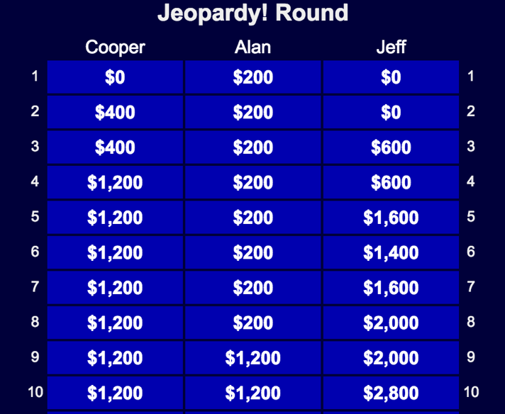

The table in Figure 1 shows the scores for each contestant on the first 10 questions in the Jeopardy! round for a particular episode. For each episode, we collected the scores data for every question in each of the three rounds. Not only did this provide the question-by-question scores as well as the total earnings, but also it gave us a chance to explore the wagering dynamics of the Final Jeopardy! round. This quantitative data was used in four of our visualizations: the heat map, the game line plot, the scatter plot, and the bipartite graph.

##Process and Related Work
###Contestant and Gender Infographics and Line Chart
We did not want to immediately present the people viewing our initial visualization with something too dense and complex. We have deeper more multidimensional visualizations later on, so we wanted to ease people into it. Narrative was important to us, so we wanted to start lower on Cairo's visualization wheel <a href="#fn4" id="ref4">[4]</a> and then move upwards. 

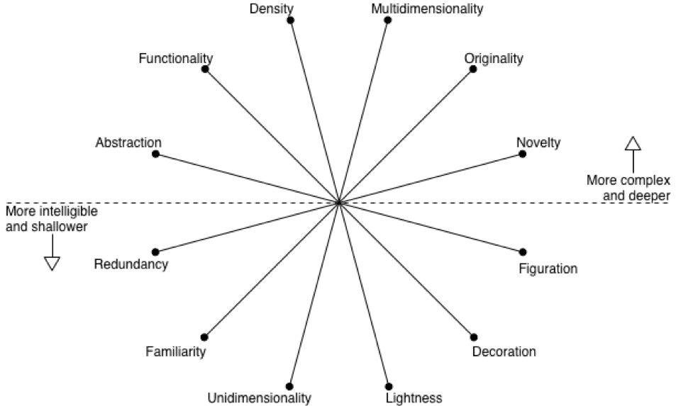

The narrative begins by telling people a bit how contestants end up getting on the show. We found pictures of the Jeopardy! podiums on Google Images, traced them in Rhinoceros (a CAD software) and imported the vectors into Illustrator to add color and text. The podiums were a way to start out the narrative in a playful way with simple numbers. The illustrations are familiar, light and decorative. The numbers provided are uni-dimensional. The fonts displayed are the actual fonts used on Jeopardy!.

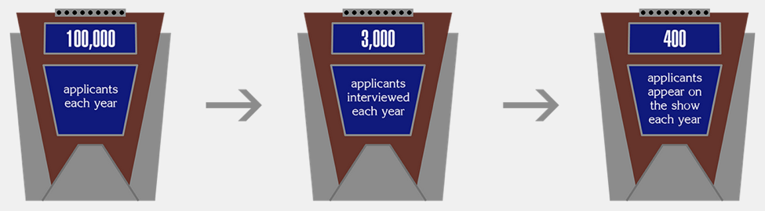

We then quickly transition into the “so what?” part of the narrative. In the illustration of the hands holding buzzers, we are pointing out that not only do fewer females win than males, but also they win less in proportion to the number of female contestants. The graphic of a hand holding a buzzer was image traced in Adobe Illustrator. 

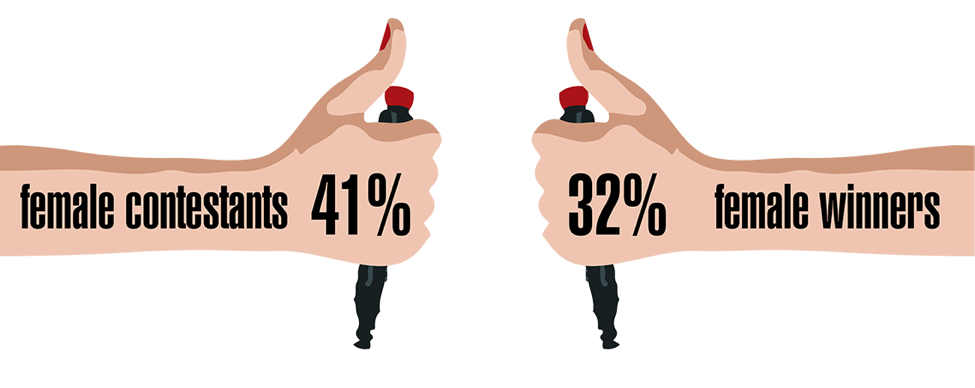

The first chart we have on the page shows the percent of female contestants and the percent of female winners from 1984-2014. Looking at Few's chapter on time-series analysis <a href="#fn5" id="ref5">[5]</a>, we see that the height of the chart is important. Making it too short makes the variability difficult to detect. Making it too tall can exaggerate the variation and mislead the readers. Our goal with the height was to balance those extremes to show more females are coming onto the show and winning, but the changes are not drastic. We are also using the Gestalt principle of similarity. The yellow color for female and blue for male matches the human isotypes in the next graphic. And the line type for contestant percentage and win percentage matches across genders. 

Another project from Few that was helpful in making this visualization was the stacked area chart on government spending [<a href="#fn6" id="ref6">[6]</a>. In particular the suggestion to use tooltips to give extra information without cluttering the whole graphic was helpful.

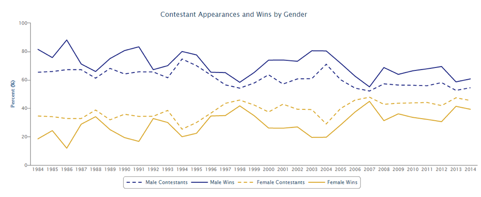

Inspiration for the isotypes of people came from the project Cairo cited by Otto and Marie Meurath about Home and Factory Weaving in England <a href="#fn7" id="ref7">[7]</a>. The goal is to communicate a simple idea with clarity and power. Showing the stark contrast in the number of male and female writers should send a strong message about what could be causing the gender gap in Jeopardy! wins. Raster images of human icons were image traced in Illustrator to convert into editable vectors. The colors were changed and moustaches were added in homage to Alex Trebek.

###Exploratory Data Analysis using Tableau
The Jeopardy! dataset from J! Archive has about 200,000 questions, answers and information covering different aspects of the game show. Also given that, arguably, the main component of the data - the questions and answers - was text, it was therefore much more challenging to visualize. However, we wanted to investigate if there were any underlying trends within this data. An overlying question or hypothesis that we were trying to answer was: Is there a smart way to study/prepare for Jeopardy!?

Below we outline the main steps of the exploratory analysis that formed the foundational insights of the main visualization:

__Step 1:__ We looked at the distribution of the number of records by air date (see Figure 7).

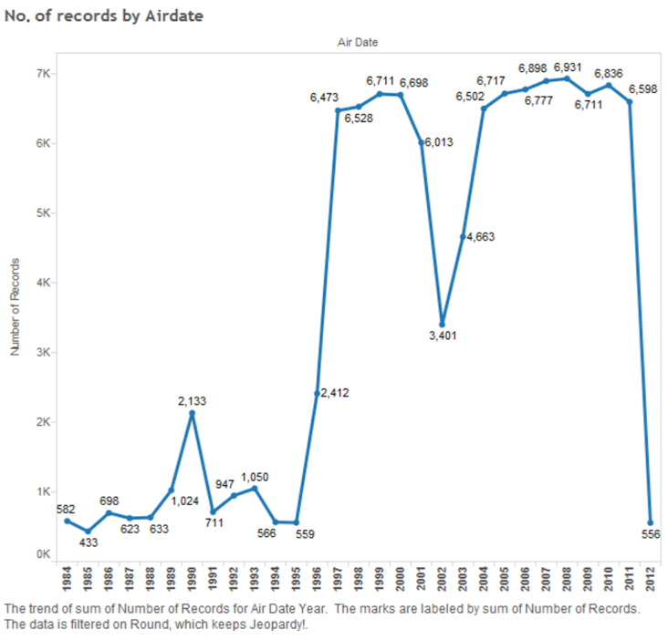

This helped us clearly see that there was a big jump in the collected data. This data has been mostly created by voluntary work of fans, and has been more diligently done after 1995. To deal with this, we decided to analyze all of our data by grouping them into 3 categories: 1984-1995, 1996-2002 and 2002-2012. The second dip was probably created as an aftermath of the 9/11 attacks, when there was either a dip in the airing of the show or in its recording and archiving by fans. This insight helped us identify more meaningful trends in the data and rule out any bias created by the lack of data.

__Step 2:__ The next step was to look at the categories over time to try to see if there any categories that are larger in proportion so that they can be considered more prominent. Traditionally, fans have always suspected "Potpourri" to be a very popular category, but our analysis revealed different results. The graph below, based on our analysis, shows "Before and After" to be at the top followed by "Science", "Literature" and "American History" before the crowd favorite "Potpourri".

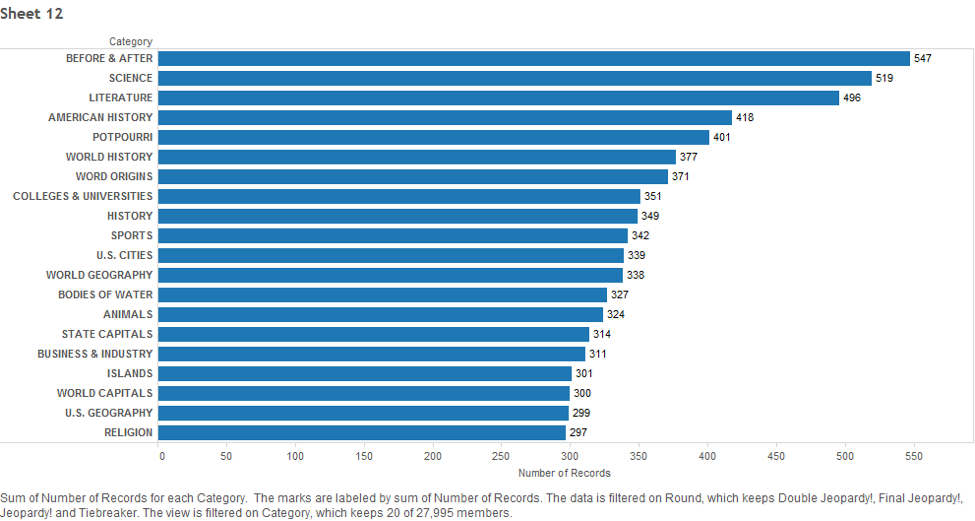

__Step 3:__ To provide more context, we plotted how this varies by season as well. This provides some interesting insights. "Before and After" did not exist as a category until 1996. Yet, after that, it has gone on to become the most popular category. In almost all the cases, there seems to be a peak in 1996-2002, even though this is not the largest category in terms of duration. This seems to have been a relatively less imaginative period in the history of the show when categories were repeated more often.

Another insight is how many topics seem to have an overlap. Many are vague, others overlap, and most seem to relate to Geography. Is there something to that?

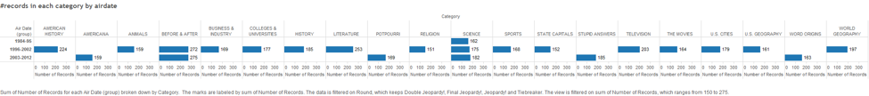

Another view of the same data:

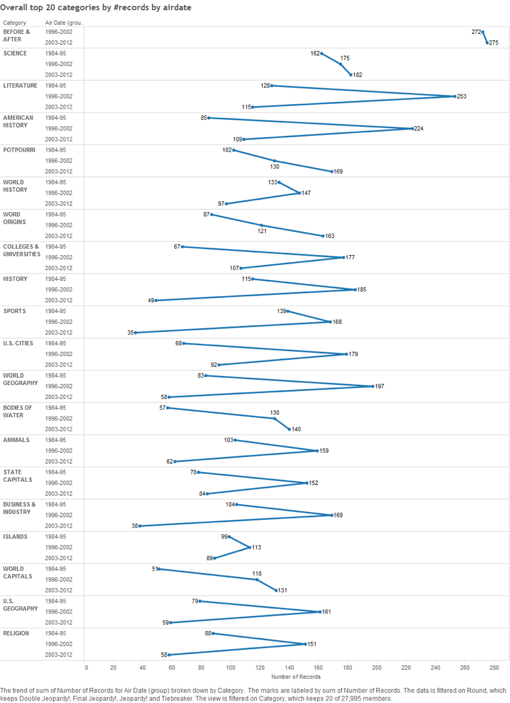

__Step 4:__ The questions are harder to analyze since they obviously need a lot of contextual information. And, after all, they form the crux of the show. One option was to try to categorize these questions into higher-level categories using Natural Language Processing (NLP), but that path took us nowhere. We soon discovered that reducing 28,000 categories would take more time than we had.

The next meaningful step was then to look at the answers. We didn't really know what to expect, but the answers definitely were interesting.

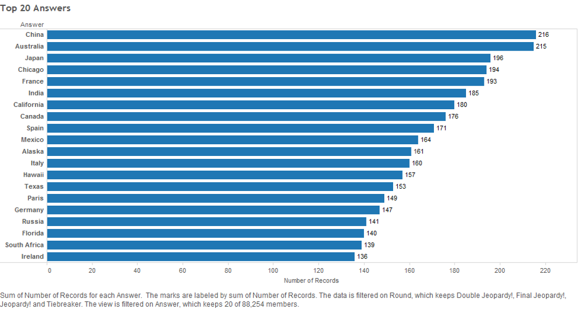

The standout commonality - everything again seems to be related to Geography. Knowing your countries may not be a bad place to start.

__Step 5:__ Now that we had a set of answers that seem to be popular, we wanted to check how these questions and categories map to each other. Even though these form a very minor fraction of the total number of distinct answers (88,000 of them!), this graph shows the categories that had the answer featured at least two times, and, as we can see, there are not so many. If we filter to include categories for which each question has at least four occurrences, this further drops to just two category-answer combinations. There are a large number of specific categories for which each answer comes up once, obviously not all related to Geography. Therefore, even if all the answers seem heavily pointing towards Geography, we cannot pick that out unless we group the categories.

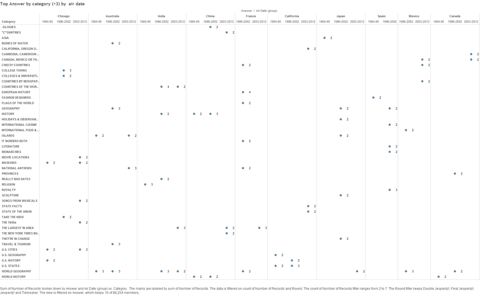

__Conclusion:__ While Geography seems to be a strong contender, unless we can group categories together we may not be able to identify an overarching favorite.

Another realization was that maybe we should have subdivided the dataset before analyzing these questions. The most sensible division was one based on the rounds in the game. So, our next hypothesis was: Is there a difference between Single Jeopardy!, Double Jeopardy! and Final Jeopardy! in terms of the content?

Below we outline the main steps of the exploratory analysis that revealed more information about our hypothesis. 

__Step 1:__ We started this process by identifying the most popular categories for each round of the show. 

This turned out to be a lot harder than we expected because of the technical challenges involved. Initially, to filter by "Round", we tried to use the simple filter option available for each category. Following is a query of that nature: "Filter by Top 10 on Count of Number of Records in Round" to try and select the top ten questions and then control this using a user filter to select the round. However, this did not work. It just retained the same questions that were used to define the query, and, on user modification, it filtered out the same list. 

A little research identified the right method to perform an operation of this sort. It was to create a "Calculated Field" and use that to create a ranking of elements within a subcategory. A very useful related work to understand this was an article written in the Tableau Knowledge base <a href="#fn8" id="ref8">[8]</a>, which describes "Finding the Top N Within a Category" where the authors use a parallel of identifying Sales within a region. The corollary in this case was identifying the top categories within a round. 

In our case, we were able to identify the top categories by each round of Jeopardy!.

![1]3(images/13.png)

__Step 2:__ To add to the categories, we found the top answers in each category. 

Insights from the “answers and questions by category” section were heavily influenced by an article we came across on Slate, which had published an article on Jeopardy! <a href="#fn9" id="ref9">[9]</a>.

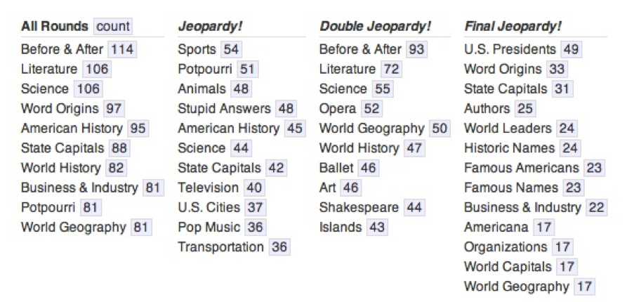

The analysis showed how a certain theme could be identified in each round. To quote the article, "Using this method of analysis, a portrait of the first round starts to emerge—and it looks like grade school. Double Jeopardy!, meanwhile, is more like college, with a touch of the yacht club while Final Jeopardy! screams patriotism, with a dash of diplomacy and a dearth of science".

__Step 3:__ We also wanted to analyse how categories varied over time. We felt that our earlier analysis showed a clustering of category repetition during a specific time frame, and we wanted to check if this extended into each round as well. Screenshots of this can be seen on the dashboard below.

__Step 4:__ We then created a dashboard to show the variation with airdate. This was based on a very similar dashboard that we came across on Tableau, which used heat maps to analyze time-based data.

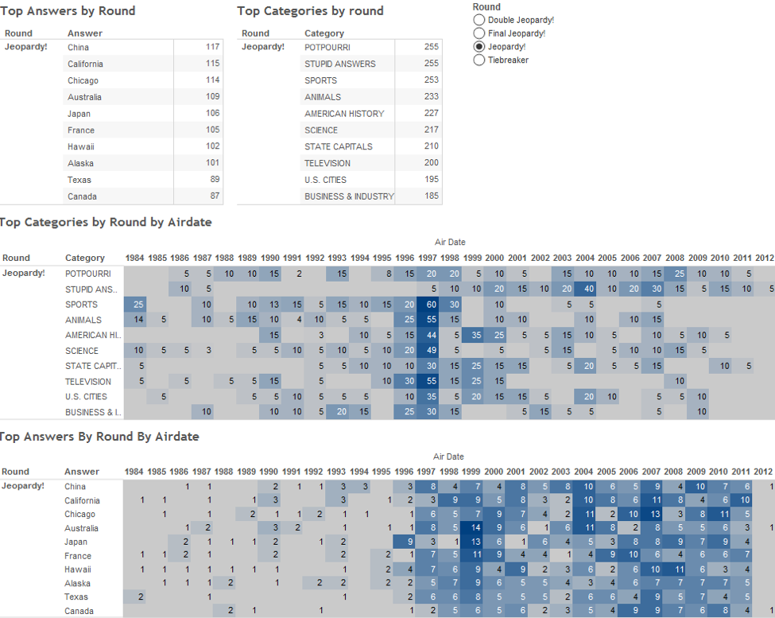

###Exploring the wagers data
This was a two-stage process. We started with some manipulation in Python to aggregate the data in the format we needed. The original data had the progress by each question, and a cumulative score per contestant after each question in the game. After transforming it to get the total by round and the individual wagers, we explored the data in Tableau.

Here, we outline the process we followed when doing an exploratory data analysis of the data about the different wagers:

__Step 1:__ Determine the relative standing of the contestants in Single Jeopardy! and Double Jeopardy!.

This was done mainly with the intention of identifying whether there was a clear and dominant winner through the game. We felt that the game was structured such that there were enough points to cause fluctuations in the player standings. We found that the data supported this assumption. We also used this data to develop a D3 visualization and show this flow. 

__Step 2:__ We wanted to see how a player's standing changed during each game, the wagers they made based on their positions and their final standing. We looked at different lists at this point: the top twenty games for which the players had made highest individual earnings, the games for which there was a minimum difference between the top two places and finally we settled on games for which there was a maximum total earnings. Since everyone did well, these games showed more fluctuation in the relative standing of the players during the game.

__Step 3:__ Creating a meaningful dashboard that showed this data in an easy-to-read manner with sufficient explanation to allow users to understand the content and interact with it. 

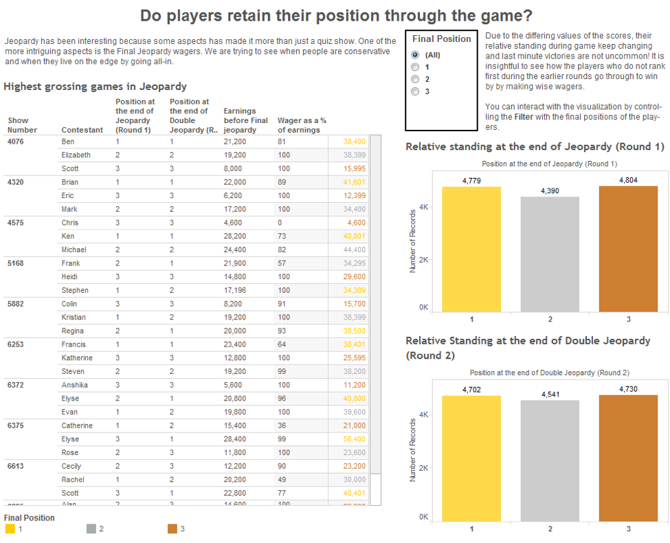

###Parallel Coordinate Visualization
We wanted to explore the top 50 contestants who had the most earnings in the game's history. We also wanted to map these contestants to some of the features such as length of winning streak, maximum earnings in a day, their gender, the region where they came from and their occupation. 

We built a parallel coordinates visualization in which each contestant is represented by a line, and the different axes were the attributes such as total earnings, streak length in days, average earnings per episode, maximum earnings in a single day, USA region, occupation and gender.

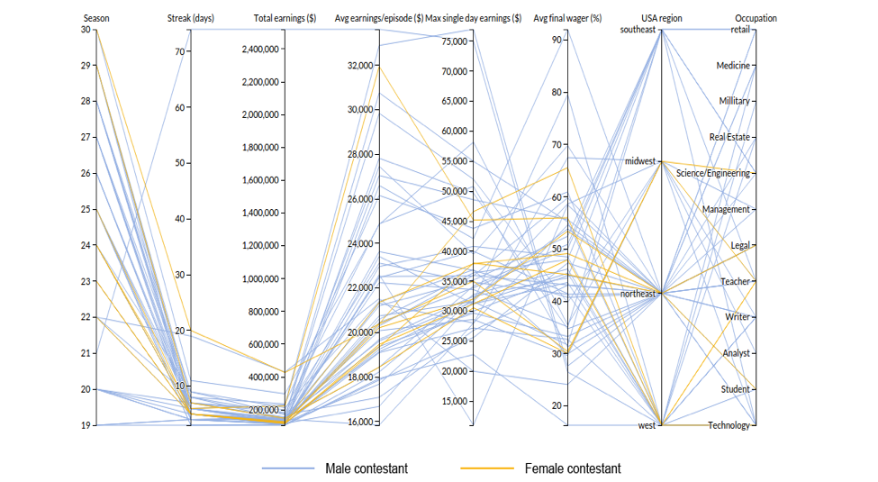

The main skeleton of the parallel coordinates visualization was inspired by similar work here: http://bl.ocks.org/mbostock/1341021 <a href="#fn10" id="ref10">[10]</a>. This visualized the various aspects of a car such as economy, power, weight, etc., which we extended to our case in Jeopardy! using the various characteristics of the contestants as axes.

####Brushing and Linking
We incorporated brushing and linking into the parallel coordinates visualization. Brushing is a very effective technique for specifying an explicit focus during information visualization. The user actively marks subsets of the dataset as being especially interesting, for example, by using a brush-like interface element. If used in conjunction with multiple linked views, brushing can enable users to understand correlations across multiple dimensions. This allows the user to filter the data based on particular values for multiple features at the same time. For example, in the picture below, we have used brushing to narrow down the seasons (23 -25), average earnings per episode ($18,000 to $30,000) and average final wager percentage (40 - 60%) all at the same time. This gives the user a lot of flexibility to play and narrow down the data.

We referred to the paper "Angular Brushing of Extended Parallel Coordinates" by Helwig Hauser, Florian Ledermann, and Helmut Doleisch <a href="#fn11" id="ref11">[11]</a>, which discusses the extensions of the parallel coordinates visualizations specifically brushing and axes reordering. The article discusses how brushing and axes ordering allow users to explore the data better, and identify connections or patterns easily. We tried to incorporate these features into our visualization so that we could provide more flexibility and functionality to the users.

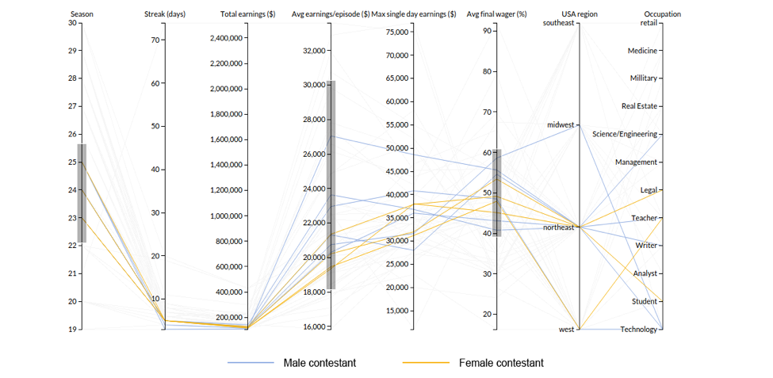

####Axes Reordering
We added a feature in the parallel coordinates visualization that allows the user to reorder the axes by dragging them into a particular gap (between two other axes), after which the axes automatically position themselves.

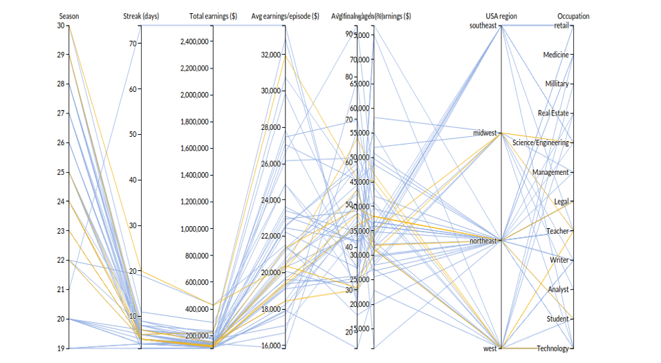

####Tooltip
We added a tooltip to identify each contestant in the line graph. Since there were a lot of interesting outliers, or extremes in the data, we decided to use a tooltip so that users can directly relate to the player when they (users) see something interesting. Another important tweak that we added was to highlight the entire path of the contestant that was selected, so that the user can focus on that particular contestant across all axes. In the figure below, we can see that the user wanted to know more about the top yellow line (yellow represents females) –the female contestant who has the highest earnings. Not only does the tooltip display the name of the contestant, but also the user can focus on the values of that contestant across all axes because of the highlighted line.

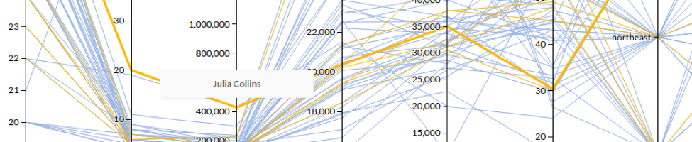

In his book Now You See It, Stephen Few talks about "Details on Demand" <a href="#fn12" id="ref12">[12]</a>. Few describes the need for precise details that cannot be seen just by looking at the data. He proposes a way to access that detail without departing from the rich visual environment called "details on demand", "a feature that allows the details to become visible when we need them and to disappear when we don’t." This reduces clutter and distractions on the screen. We took a cue from Few and tried to implement this for most of the visualizations such as the line charts, parallel coordinates and the calendar heat map.

####Gender Divide
Once we included gender, occupation and USA region, we observed that there was a strong skew in favor of males - there were 42 males and only 8 females in the top 50 contestants. We decided to highlight this issue under the gender divide section, so we removed gender as an axis and used colors (used across all visualizations to represent genders) to distinguish the gender of a contestant.

###Slider
Working with 30 seasons of Jeopardy! data challenged us to think of effective ways to display the data. In many applications, such as with a scatter plot, showing too many data points can detract from the goal of a visualization. Filtering, as Stephen Few defines, "is the act of reducing the data that we're viewing to a subset of what's currently there" <a href="#fn13" id="ref13">[13]</a>.

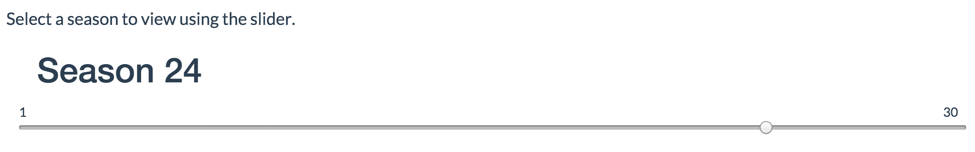

A slider, because of its horizontal layout, which can be indicative of a time-based relationship, was a logical choice for us to filter the Jeopardy! data. This was created using an HTML range object. In addition to including the minimum and maximum values on the left and right sides of the slider, respectively, we added a season label above it. This works using two functions. First, the user gets immediate feedback on the position of the slider with the use of the oninput event; this updates the season label based on the slider position, letting users know which season they would select were they to release the slider. The second function makes use of the onchange event, which actually triggers a change in the data filter. For more information on these functions, see the onchange vs. oninput for Range Sliders article <a href="#fn14" id="ref14">[14]</a>.

###Heat Map
Drawing inspiration from the exploratory data analysis in Tableau, specifically the heat map on the categories and answers, we chose to use a heat map to provide an overview of the earnings data. The heat map was created using a web API (no longer available), though we slightly modified the JavaScript for our purposes.

We first started by exploring the data by year, which is a natural way to consider time series data. We then realized that the earnings information covered two seasons and that it would show a gap during the summer when the show is off the air. Based on this, we decided to visualize the data at the season level. We also made the decision to separate each calendar month. This was intended to make it easier for users to target a specific date. The labels are also meant to aid in that process.

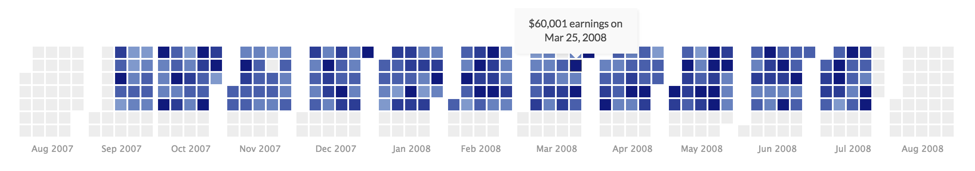

There are seven squares in (almost) every column of the heat map, each representing a day of the week. The gray squares are ones without data; this is for either the summer, the weekends, or days with missing data. The two rows of gray squares at the bottom help frame the blue-shaded ones.

Because the heat map covers an entire season, we decided to structure it by month. In the heat map, each square corresponds to a particular date, and the darkness of the shading indicates the earnings level. As Stephen Few describes, "there are times when we need to see precise details that can't be discerned in the visualization" <a href="#fn15" id="ref15">[15]</a>. This is the case with the heat map. It is intended to show a general overview of the earnings in a particular season. To Few's point, we added a tooltip, or "pop-up box", as he calls it, to the heat map to show additional information when a square is moused over. (On mobile devices, an individual square must be clicked on.) The squares show the relative earnings on a particular episode and are based on the following range: [10000, 25000, 40000, 55000]. For example, there is a shade for less than 10,000, between 10,000 and 25,000, etc.

###Linking Line Chart
We implemented Few's concept of "focus and context together" using the linking line charts. After we built a calendar heat map to display the total and average earnings for each of the episodes for a particular season, we integrated it with a slider that allows the user to switch through the different seasons. We decided to link a line graph to the episode heat map so that, when a particular episode for the heat map is clicked on, a line chart is generated that shows the entire flow of the game on that particular episode. The line chart was developed using highcharts and has a line for each of the three contestants. The colors for the three lines in the line chart carry over from the ones we have used to denote positions across the entire site (gold for first, silver for second and bronze for third).

We integrated a tool tip for the line charts based on Few's "Detail on Demand" <a href="#fn16" id="ref16">[16]</a>. The tool tip shows scores after a particular question when a user mouses over at a point on one of the lines in the highcharts. We plan to add the contestant names in the future so that the user can get a better understanding of who was playing. We will have to merge multiple datasets on a primary key to include the contestant name.

The toughest challenge that we faced in integrating the line chart was to filter the data based on the date corresponding to the square that was clicked on the season heat map. We also defaulted to the first episode of the season when the slider was moved to change to a different season.

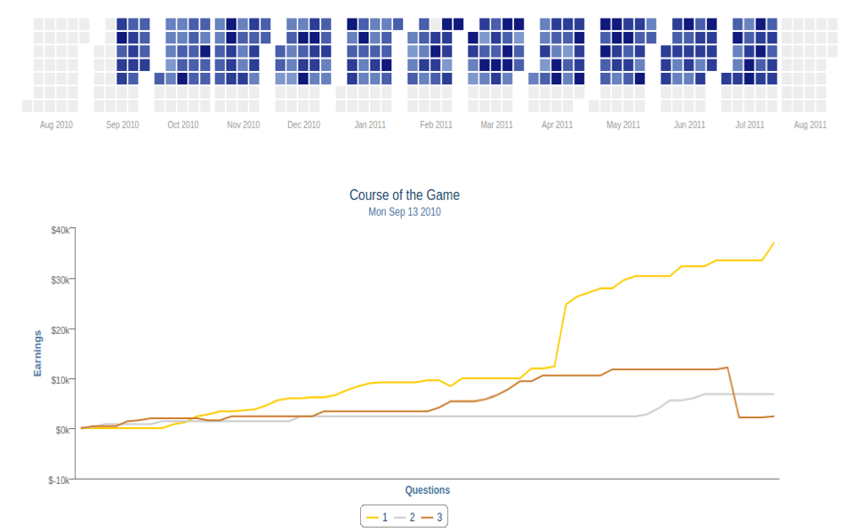

###Scatter Plot
Another facet of the game we were interested in exploring was the Final Jeopardy! wagers. As shown below, the biggest potential for earnings and position changes occurs in the Final Jeopardy! round. To explore how contestants make wagers, we created a scatter plot of wagers against earnings.

On the x-axis, we plot the earnings going into the Final Jeopardy! round. The circles are colored based on the contestants' position at this point in time. We decided that this was more indicative of the types of wagers contestants make. 

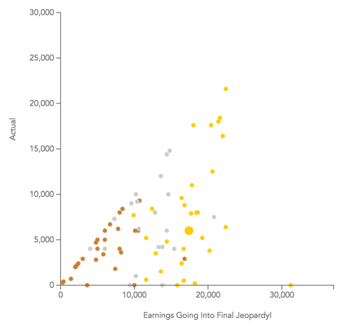

For example, we can see that, in general, contestants in third place, identified by the bronze color, wager all or close to all of their earnings. An additional feature we added was the ability to discriminate between objects by increasing the size of the circle that is moused over. As Cairo explains, "the brain groups similar objects (the rectangles of same size and tone) and separates them from those that look different" <a href="#fn17" id="ref17">[17]</a>.

While the first place contestants place higher wagers, they place the lowest wagers on a percentage basis. This is why we included a dropdown menu for users to select between an "actual" and "percentage" view. (The circle that was called out in the previous screenshot is called out again below.)

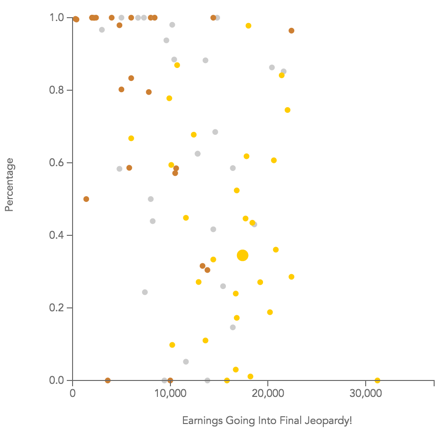

We also thought significantly about transitions with this data. When transitioning between the actual and percentage views, we decided to keep the circles the same colors, but change their size by making them slightly smaller during the transition and then returning to their regular size. This was done to signal that the circles in each view correspond to the same data point (contestants). In contrast, when changing between seasons, the circles change to black on the transition so that it's clear that the circles refer to other data points.

###Bipartite Graph

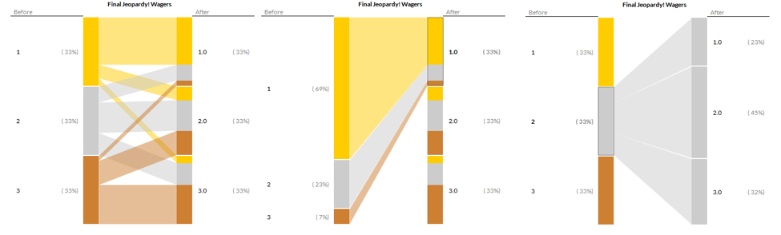

The idea and concept for this visualization was directly related to the exploratory analysis we did earlier. This visualization was effective in showing how the players changed their positions before and after Final Jeopardy!. While not the most common occurrence, it is nevertheless sufficient to talk about.

This visualization was strongly based on a D3 example for Bipartite graphs <a href="#fn18" id="ref18">[18]</a>.

We used this as reference to create the visualization using data cleaned and generated by Python, and fed directly into this backend. This shows the percentage in each category before and after the main action - the final wager. It re-enforces the ideas discussed in the exploration dashboard.

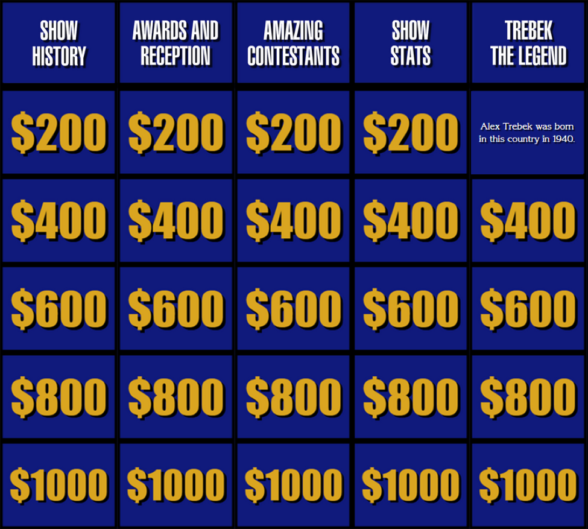

###Jeopardy! Game Board

After people reached the end of our visualization, we wanted to give them something fun to play with at the end of the game. It is an interactive activity that we thought would be entertaining for groups of people. Most of the facts used on the board were collected from Wikipedia, blogs and other articles <a href="#fn19" id="ref19">[19]</a> <a href="#fn20" id="ref20">[20]</a> .

We wrote the questions ourselves, devised a way to categorize them and used Justinmind, an interface prototyping tool, to make the game interactive. We looked up articles on the fonts used in Jeopardy! [21], downloaded them and used them on this board (as well as the title of the webpage) to make it all look authentic.

##Acknowledgements

We would like to thank Professor Hearst, without whom this work would not have been possible. Her thoroughness in feedback and her encouragement were instrumental during our progress. We gained valuable knowledge from Alberto Cairo's "The Functional Art". We benefitted greatly from the various D3 examples on www.bl.ocks.org. We would also like to thank the team at The iSchool Review for patiently working with us to publish this.

##Interactive Visualization
[http://people.ischool.berkeley.edu/~japple/jeopardy/](http://people.ischool.berkeley.edu/~japple/jeopardy/ "http://people.ischool.berkeley.edu/~japple/jeopardy/")

##Bibliography (Only Related Work)

1. Appleman, Gupta, Rajagopal, Shishido, Hearst, Exploring Data For Fun And Profit: Case Study of Jeopardy! Poster, IEEE Infoviz, October, 2015. <a href="#ref1" title="Jump back to footnote 1 in the text.">↩</a> 

2. 200,00+ Jeopardy questions in a JSON post, https://www.reddit.com/r/datasets/comments/1uyd0t/200000_jeopardy_questions_in_a_json_file . <a href="#ref2" title="Jump back to footnote 1 in the text.">↩</a> 

3.	J!Archive, The fan created archive of Jeopardy! Players and games, http://j-archive.com/ . <a href="#ref3" title="Jump back to footnote 1 in the text.">↩</a> 

4.	Cairo, Alberto. The Functional Art: An introduction to information graphics and visualization. New Riders, 2012. p. 51, Visualization Wheel . <a href="#ref5" title="Jump back to footnote 1 in the text.">↩</a> 

5.	Few, Stephen. Now you see it: simple visualization techniques for quantitative analysis. Analytics Press, 2009; visualization Time series analysis (Pg 146) <a href="#ref5" title="Jump back to footnote 1 in the text.">↩</a> 

6.	Few, Stephen. Now you see it: simple visualization techniques for quantitative analysis. Analytics Press, 2009; visualization project on government spending (Pg 305) . <a href="#ref6" title="Jump back to footnote 1 in the text.">↩</a> 

7.	Cairo, Alberto. The Functional Art: An introduction to information graphics and visualization. New Riders, 2012 p. 72 Project by Otto and Marie Meurath about Home and Factory Weaving in England . <a href="#ref7" title="Jump back to footnote 1 in the text.">↩</a> 

8.	Tableau knowledge base on Calculated Fields http://kb.tableau.com/articles/knowledgebase/finding-top-n-within-category . <a href="#ref8" title="Jump back to footnote 1 in the text.">↩</a> 

9.	I'll Take Jeopardy! Trivia for $200, Alex,  Jeremy Singer-Vine, http://www.slate.com/articles/arts/culturebox/2011/02/ill_take_jeopardy_trivia_for_200_alex.html . <a href="#ref9" title="Jump back to footnote 1 in the text.">↩</a> 

10.	Parallel Coordinates D3 http://bl.ocks.org/mbostock/1341021 . <a href="#ref10" title="Jump back to footnote 1 in the text.">↩</a> 

11.	Brushing for ordinal variables http://bl.ocks.org/mbostock/4349509 . <a href="#ref11" title="Jump back to footnote 1 in the text.">↩</a> 

12.	Few, Stephen. Now you see it: simple visualization techniques for quantitative analysis. Analytics Press, 2009; Data on Demand, pg 116 . <a href="#ref12" title="Jump back to footnote 1 in the text.">↩</a> 

13.	Few, Stephen. Now you see it: simple visualization techniques for quantitative analysis. Analytics Press, 2009; Filtering, pg 68 . <a href="#ref13" title="Jump back to footnote 1 in the text.">↩</a> 

14.	onChange vs onInput for Range Sliders, Louis Lazaris, http://www.impressivewebs.com/onchange-vs-oninput-for-range-sliders/ . <a href="#ref14" title="Jump back to footnote 1 in the text.">↩</a> 

15.	Few, Stephen. Now you see it: simple visualization techniques for quantitative analysis. Analytics Press, 2009; - Level of precision in detail [Page 87]. <a href="#ref15" title="Jump back to footnote 1 in the text.">↩</a> 

16.	Few, Stephen. Now you see it: simple visualization techniques for quantitative analysis. Analytics Press, 2009; Details on Demand, pg 116 . <a href="#ref16" title="Jump back to footnote 1 in the text.">↩</a> 

17.	Cairo, Alberto. The Functional Art: An introduction to information graphics and visualization. New Riders, 2012 p. 114 . <a href="#ref17" title="Jump back to footnote 1 in the text.">↩</a> 

18.	Bipartite graph http://bl.ocks.org/NPashaP/9796212 . <a href="#ref18" title="Jump back to footnote 1 in the text.">↩</a> 

19.	Jeopardy facts, Mashable.com, http://mashable.com/2014/03/30/jeopardy-facts/ . <a href="#ref19" title="Jump back to footnote 1 in the text.">↩</a> 

20.	Jeopardy Trivia, Grandparents.com, http://www.grandparents.com/food-and-leisure/did-you-know/jeopardy-trivia
Font used in Jeopardy, http://fontsinuse.com/uses/5507/jeopardy-game-show . <a href="#ref20" title="Jump back to footnote 1 in the text.">↩</a> 

