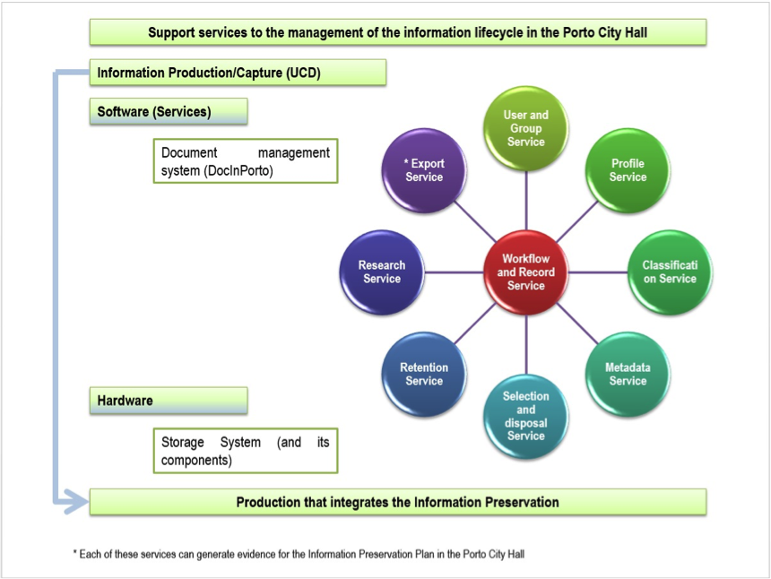
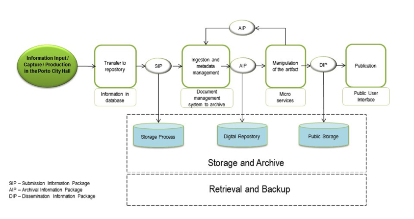
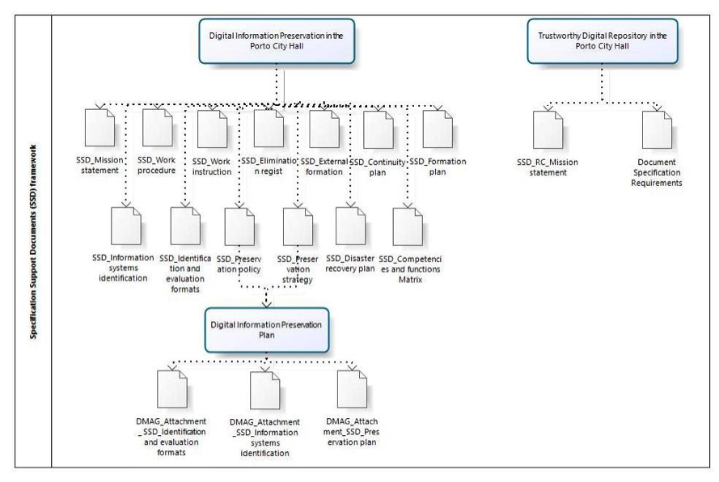
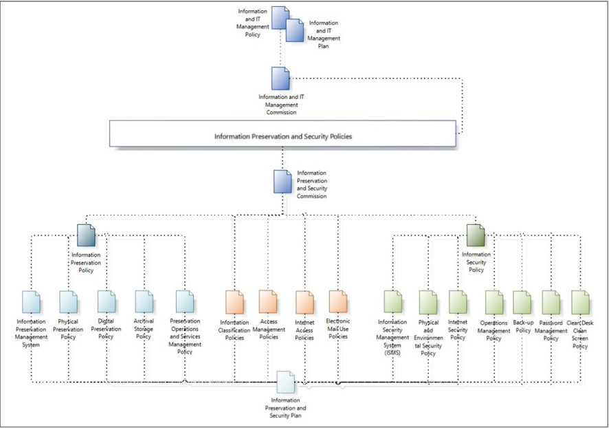
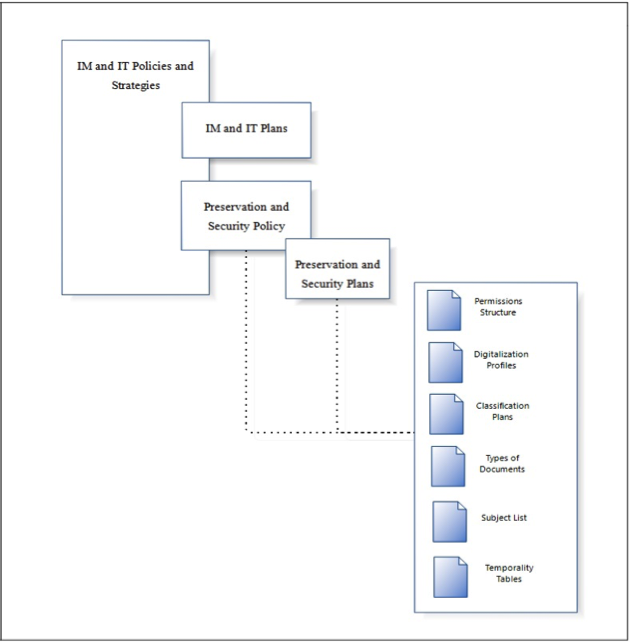

##INTRODUCTION

The growth in digital information is increasingly challenging for Information Management (IM).
Nevertheless, with the new models, processes, tools and techniques that aim to respond to the launched challenges, concerns emerge, such as the ones connected to information preservation and information security, to which professional groups such as archivists, especially in the first case, and IT engineers, in a particular way in the second, are particularly sensitive. 

The developed analysis points to the clear need for an integrated and interdisciplinary management of the whole information lifecycle, considering its complexity and multidimensional nature along with the existence of increasingly faster technological obsolescence cycles (hardware and software) that cause increasingly higher risks and preservation costs. 

Therefore, it becomes necessary to guarantee the application not of one strategy but of several preservation strategies in the long term that in itself is not a solution. Because without a holistic and systemic approach to the Organization / Institution, to its processes and actors and to its Information System (IS) and Technological Information System (TIS), it would be not only difficult to operationalize but also impossible to identify and delimit from the outset, being only one aspect between many others.

This "challenge" requires a vast knowledge of the themes connected to Information Preservation and Security and imposes itself far beyond Technology, including as essential elements: the Organization, its actors and processes, as well as the produced, received, accrued and used information.
The approach taken points out that one way of securing the mentioned attributes demands the definition and implementation of appropriate Policies, Strategies and Preservation Plans that include the whole information lifecycle – conception of the technological platform, production / capture, flow, organization, representation and description, storage, evaluation / selection, preservation, access and use – in the framework of IS but also TIS management in the organization as a whole.

Therefore, the work of the professionals must put diversified levels in perspective, namely the culture, the policies, the strategies and the plans that, in the different organizations / institutions, assume and make Information Management (IM) and Information Technologies Management (ITM) flow together. These efforts conjugate and integrate the performance during the management of the information lifecycle and the technological platforms of support, including aspects such as of Information Preservation and Security, either when recorded in traditional / analogical media or in digital media.

In this context the results of the collection of the state-of-the-art research carried out will be presented having as a reference information preservation in a perspective of continued access and use in the long term, only possible if it is integrated effectively in the management processes of the organizational information system, from the production / capture phase to its selection and long-term storage.

This positioning is embodied in the developed Model, a municipal approach which has a particular interest to be adapted by other municipalities. In fact, it could be a guide for the development of the organizational, informational and technological framework that will lead, for example, to the certification of the Digital Archive.

The design of a Digital Archive / Repository, reliable and put in a long-term perspective, demands precisely an IM integrated approach that comprises the whole information lifecycle, assuming preservation and security as two linked criteria to be observed along with. The main goal is to provide the production, storage, use and availability of reliable, authentic, trustworthy and intelligible information.

A framework of main guiding instruments presented as being crucial is highlighted, identifying in the information security field, ISO/IEC 27001:2005; in the IT services management field, ITIL’s best practices and ISO/IEC 20000:2005; in the creation of the active and permanent information system, MoReq2010 in the information preservation field, ISO 14721:2012 – Space data and information transfer systems – Open Archival Information System – Reference Model,  ISO/TR 18492:2005 – Long-term preservation of electronic document-based information and ISO 16363:2012 – Space dates and information transfer systems –Audit and certification of trustworthy digital repositories.

The proposed Information Preservation and Security Model (IPSM) consecrates precisely, “the act of thinking about the Organization, its business processes and actors, its IS and the ITS that supports it” (Sousa, 2013). It promotes interdisciplinary teams that, in the Municipality of Porto, bring together the Municipal Direction of Information Systems (DMSI) and the Municipal Direction of Culture - Archives in order to design, implement and monitor the Municipality of Porto Policies, Strategies and Information and IT Management Plan. At the basis is a theoretical and methodological approach built on the contributions of a new IS paradigm (scientific and post-custodial) and the fundamental partnership Information Management / Technological Information Systems Management.

##INFORMATION PRESERVATION AS A VARIABLE OF INFORMATION MANAGEMENT 

Information Management and particularly Information Preservation in a digital environment, presents itself as a concern to which several organizations and institutions try to answer, as it happens with traditional media.
In the designated “digital challenge” there are two issues to be addressed (Pinto, 2010):

1. the need to guarantee the intelligibility and the continued access to information, regardless of technological changes;
2. the inseparable need of the unmistakable identification of the context of production of that information and of subsequent interventions.

Information unity demands that the preservation in a digital context is based on a multidimensionality that integrates: the physical dimension, the logical dimension, the conceptual / intellectual dimension and the essential dimension (Pinto, 2009a). The lifecycle of any information unit (simple or compound, “analogic” or digital) is essential for its preservation.

“Let's take, as an example, a higher education institution; a digital object will be created in an academic department, some information on the object will be in another department, the details on the author can be stored at some place in the records management unit, the object will be used by a number of pupils and employees, and a copy of the object can be sent to the library or archive for preservation, the library or archive employees can have access to some contextual information on the digital file or not. This object has a history of a long and complicated life, most of it unknown to the person who has to file it, probably, when it is at the end of its life history. If, nevertheless, the concept of continuity of the lifecycle will be taken into account so that the relevant information has been recorded along the way, and it is recognized that all the divisions, departments or sectors of an organization are responsible for this object in particular, then its longevity and the perspectives of reuse are substantially higher” (Beagrie, et al., 2008).

This is an approach that, given the challenges of managing information systems that are completely digital or hybrid, assumes information preservation as a variable of information management, maintaining the focus on the info-communicational phenomenon and processes, which are supported by the systemic theory and embodied in the model of the Active and Permanent Information Management System (SI-AP), which is: 

“…an alternative to empirical methodologies and that is the methodological base - to approach an information management cycle that, from its planning phase, comprises the production, capture and collection of information, its processing / organization, its flow, its appraisal and disposition, its storage, its use and dissemination, as well as its management / maintenance, assuming information preservation as a variable of information management present in all this cycle (also summoning  the areas of Information Behavior and Information Organization) and susceptible of being considered either in scientific studies, or in the resolution of concrete cases, maintaining the goals to guarantee the authenticity, reliability, integrity and intelligibility of information, as well as the continued access in the long term” (Pinto, 2009b).

##AN ACTIVE AND PERMANENT INFORMATION MANAGEMENT SYSTEM

An Active and Permanent Information Management System considers the whole information lifecycle, the information multidimensionality and the “several” interoperabilities. It requires an information management with quality based on the definition of the Information Management Policy that will guide the Information Management System. Its implementation assumes the need for evolving from a most common approach at the level of a Documental Management System, supporting the business”, to a Management System for Records (MSR), as proposed by ISO 30300 and ISO 30301.
In this context, tools as MoReq2010 (Modular Requirements for Records Systems) are a fundamental guide. It establishes good practices concerning the design of information systems (VIEIRA, et al, 2011) and it determines minimum requirements that an information system must respect, after the technical / IT requirements are defined. 
The core functional requirements of MoReq2010 are gathered in nine service definitions: 

1. User and Group Service;
2. Profile Service;
3. Classification Service;
4. Model Metadata Service;
5. Disposal Scheduling Service;
6. Disposal Holding Service;
7. Searching and Reporting Service;
8. Export Service; and
9. Record Service.

The set of these services describes, precisely, the features of a MoReq2010 ® Compliant Records System (a MCRS). 

Figure 1 provides an overview of the basic structure of “Services” and it will guide the work to be developed in several phases (lifecycle, hardware, software and services phases, in line with the proposed by MoReq2010). The Preservation Management Service should be comprised of the structure that consists of a set of features that will allow the implementation of the necessary policies for Information Preservation.

Thus, figure 2 follows the previous one, since it illustrates at a high-level the Digital Information Preservation Management Service in the Municipality of Porto, where supported by the OAIS model we can specify the main steps of the process: entry / ingestion (SIP), processing / management (AIP) and information dissemination (DIP) in the digital repository.
 

##INFORMATION STRUCTURE SUPPORTING THE INFORMATION PRESERVATION MANAGEMENT SERVICE

The need of the Municipality of Porto to certify the digital repository leads to the need to create an Information Preservation Plan. So being, and as a starting point, one established the need to create the bases for the construction of this Plan as one of the instruments supporting the certification of the digital repository, together with the Information Security Plan .

For the creation of the Information Preservation Plan in a digital environment and consequently the implementation of the certification at the level of the digital repository, the first proposal was to create the whole specification support structure.

Therefore, it was necessary to approach two fields and understand the deficiencies at a documental level in order to be able to work in the context of Information Preservation, and to contribute to the creation of a Preservation Plan in the area of the reliable digital repository.

Taking into account the collection of the normative instruments, namely ISO 16363 and ISO 18492, models and guides of existing good practices such as the cases of London (Guildhall library manuscripts and london metropolitan archives, 2004) and Sheffield Municipalities (Sheffield archives and local studies group, 2007) a documental support structure was prepared, referred as Specification Support Documents (SSD) that intend to be practical guides, i.e. information bases, which will have to be consulted and followed, so that the Information Security and Preservation Model of the Municipality of Porto can be developed, an essential contribution for the certification process of the digital repository.

So, the documents structure that will support the Information Preservation Plan implementation, which is, in this 1st phase, focused in digital media, stands out: the Preservation Plan; the Preservation Strategy; the Preservation Policy; the Identification and Evaluation of Formats; the Information Systems Identification; the Mission Statement; the Guard Agreement; the Contingency Plan and the Disaster Recovery Plan. 

 
As a main conclusion, we can think that, both the preservation and the security of the information face enormous challenges, coexisting risks, because one of the main concerns is to secure the existence of an IM that is efficient and takes into account the current problems, resulting especially from the digital medium, being this a reality of which many organizations have only recently become aware.

##INFORMATION PRESERVATION AND SECURITY MODEL

The Information Preservation and Security Model (IPSM) consists of a high-level representation that is an inseparable precondition for the development of a Preservation Plan, and, in the medium term, to the achievement of a strategic objective such as the certification of a Digital Repository. It brings together the Information Management System (IM) and the IT Service Management (ITS) in a holistic and integrating vision that will guide the development of several plans that involve the IS and the ITS of the Municipality of Porto.

It has the potential either of being replied by other municipalities or, at least, being used as part of a guiding framework that will lead to the creation and certification of an organizational digital archive, as a preservation repository.

Organically, it is possible to see in the illustrated model (Figure 3), the importance and the inter-relation between the Information Security Policies and the Information Preservation Policies, based on a shared Information and IT Management Policy, and the related Plan, under the monitoring of an Information and IT Management Commission. This top-level/strategic commission will supervise the Security and Preservation Commission, composed by staff members from Technological Information Systems Unity and Information Management/Archives Unit. This team shares an holistic and integrated vision of the plans to be developed, as well as the perspective either in physical terms (infrastructures/ material medium), or in logical terms. 

So, starting with the Information Preservation and Security Commission (IPSC) and its control, it’s action should be based on a set of essential documents, among which stand out the Information Security Policy and the Information Preservation Policy.

As common Policies to both areas (Preservation and Security) to be established by IPSC, we can find: Information Classification Policies; Access Management Policies; Internet Access Policies and Electronic Mail Use Policies. As for the Information Preservation Policy, its main components are: Information Preservation Management System; Physical Preservation Policy; Digital Preservation Policy; Archival Storage Policy; Preservation Operations and Services Management Policy.

Regarding the Information Security Policy, it contains as fundamental elements: Information Security Management System (ISMS); Physical and Environmental Security Policy; Internet Security Policy; Operations Management Policy; Back-up Policy; Password Management Policy and Clean Desk Clean Screen Policy.

All these constituent elements, both of Information Preservation and of Information Security, that together will be fundamental to building the Information Preservation Plan and Information Security Plan of the Municipality of Porto.

As an attribute of the IPSC, there will also have to be implemented a Digital Preservation Planning Committee (DPPC) that should act as an advisory group for projects and development of systems inside the Municipality of Porto concerning digital preservation. The DPPC will develop policies for the preservation, meta-information levels and preservation actions included in the Digital Information Preservation Plan of the Municipality of Porto, based on stakeholders’ requirements, the priorities for the institution and the best practices. The Committee will inform the requirements of the system for the implementation of these policies.

A need and alert are even more justified if we take the base currently used as guidance for the Public Administration concerning Documental Management as a comparison point. In fact, it is a vision that is confined to a specific extent but that can promote the idea of uniformity, simplicity and linearity that does not correspond to the complexity and to the quick changes that the organizations and institutions face in the current society.

There are different models, methods, technical methodologies and tools at our disposal to build, with efficiency, an Information Preservation Plan, but, we cannot do so without an holistic, systemic and integrated vision, concerning the organizational policies and strategies with a broader scope, as the IM and IT Policies and Strategies. This top-level document is the basis of a process that includes the preparation of a Digital Preservation Plan. In the other hand, this plan is an element of the documental structure that supports organizational IM, being, also, one among other instruments that needed to be created for the certification of the Repository.

As shown in Figure 5, our positioning points that IM and IT Policies and Strategies must appear upstream and as a cornerstone in this process, thinking jointly IM and IT areas and aligning them with organizational policies and strategies. 

Based on these are establish both the Information Preservation and Information Security policies, and consequent Plans, followed by the creation of several instruments, such as classification plans, subject lists or appraisal and disposition tables.

##CONCLUSION
As it is possible to easily infer, as we come across a more and more digital world, we can never neglect the issues that it raises, particularly concerning information preservation and security. IM must guarantee continued access in the long term and is an essential and indispensable resource and instrument of the persistence and memory of institutions, organizations and persons.

As Pinto (2004) referred, “after the technological jump it was necessary to undergo the basic “change of the organizational structure of the Public Administration” and the corresponding “change of the organizational culture”, in the context of a society characterized by the capacity of its members (Citizens, Enterprises and State) to instantly obtain and share any kind of information and knowledge, from any place and in the most convenient form”.

A Reliable Digital Repository, and the inherent guarantee of the attributes of authenticity, integrity, accuracy, intelligibility and preservation of information in the long term, requires the definition and implementation of the appropriate Policies, Strategies and Plans. The focus should be on the entire information lifecycle, including the design of the technological platform, the production / capture, the flow, the organization, representation and description, the appraisal / disposition, the storage, the preservation, the access and the use of information, in the framework of a holistic and integrated approach of the management of the Information System and the Information Technologies.

It is possible to observe the dimension and importance of the inter-relation between Information Preservation Policies and Information Security Policies. Nevertheless, these must be based on a more general Policy such as that of IM and IT, and on the respective Plan.

Therefore, it is confirmed the need to implement a true AP-IS that encompasses the whole information lifecycle, the multidimensionality and the interoperability. In addition to information preservation in digital media (as is the case with digitized documents), the true problem concerns the born digital generation, as there is not a paper version of these objects, which makes all this process imbued with greater complexity.

So, one can see the relevance of information preservation in digital media. It should be thought of as a set of actions orientated and regulated under the designation of Preservation Management Service, to be developed in the context of IM, integrating a structure of IM Services in a future Information Management System.

At the basis we can find Information, as a human and social phenomenon, and an Information Management assumed as a cross-sectional and applied area in Information Science and defined as the study, conception, implementation and development of processes and services related to infocomunicacional flow, allowing the construction of implementation models for maximum efficiency and profitability (Pinto, 2015:547).

 
##REFERENCES

Brandão, M. (2010). Arquitectura de Sistemas de Informação alinhada com a política de gestão de informação das unidades orgânicas na Câmara Municipal do Porto. Tese de mestrado integrado, Universidade do Porto, Faculdade de Engenharia, Porto, Portugal.

GUILDHALL LIBRARY MANUSCRIPTS AND LONDON METROPOLITAN ARCHIVES (2004). Interim Digital Preservation Policy. City of London – Libraries, Archives and Guildhall Art Gallery Department. Retrieved December 17, 2013, from
http://www.history.ac.uk/gh/digprespol.pdf

ISO 14721:2012. Space data and information transfer systems – Open Archival Information System – Reference Model. Geneva, Switzerland: ISO, 2012.

ISO 16363:2012. Space data and information transfer systems – Audit and certification of trustworthy digital repositories. Geneva, Switzerland: ISO, 2012.

ISO/TR 18492:2005. Long-term preservation of electronic document-based information. Geneva, Switzerland: ISO/TR, 2005.

ISO/IEC 20000:2005. Information technology -- Service management. Geneva, Switzerland: ISO/IEC, 2005.

ISO/IEC 27001:2005. Information technology – Security techniques – Information security management systems – Requirements. Geneva, Switzerland: ISO/IEC, 2005.

Oliveira, H. A. (2014). A Preservação da Informação: um contributo para a implementação de um Arquivo Digital Certificável no Município do Porto. Dissertação de Mestrado. Universidade do Porto, Porto, Portugal.

Pinto, M. M. (2015). A Gestão da Informação nas Universidades Públicas Portuguesas: Reequacionamento e proposta de modelo. Tese de Doutoramento em Informação e Comunicação em Plataformas Digitais, Universidade do Porto, Faculdade de Letras, Porto. Universidade de Aveiro, Departamento de Comunicação e Artes, Aveiro, Portugal.

Pinto, M. M. (2011). Da transferência de suporte ao Sistema de Informação Organizacional: Um posicionamento urgente e estratégico. Seminário - (R)evolução da Informação Pública: preservar, certificar e acessibilizar. Lisboa. Retrieved November 10, 2015, from http://hdl.handle.net/10216/74220.

Pinto, M. M. (2009a). Preservmap: Um roteiro de preservação na era digital. Porto: Edições Afrontamento. Coleção: Comunicação-Arte-Informação; 8. ISBN: 972-36-1070-1.

Pinto, M. M. (2009b). Gestão da Informação e preservação digital: uma perspectiva portuguesa de uma mudança de paradigma. CONGRESO ISKO-SPAÑA, 9, Valencia. Nuevas perspectivas para la difusión y organización del conocimiento: actas. Valencia: Universidad Politecnica de Valencia. pp. 323-355. Retrieved December 2, 2015, from http://hdl.handle.net/10216/25380.

Pinto, M. M. (2004). Gestão integrada de sistemas de informação em autarquias locais: uma abordagem sistémica. Porto: Universidade do Porto. Faculdade de Letras. Retrieved October 25, 2015, from http://hdl.handle.net/10216/7733.

SHEFFIELD ARCHIVES AND LOCAL STUDIES GROUP (2007a). Preservation &
Conservation Policy. Retrieved November 13, 2013, from
https://www.sheffield.gov.uk/dms/scc/management/corporatecommunications/
documents/leisure-culture/libraries-copyright/archivespolicies/Preservation-and
Conservation-Policy--PDF--73-KB-.pdf

SHEFFIELD ARCHIVES AND LOCAL STUDIES GROUP (2007b). Digital Preservation Policy. Retrieved November 14, 2013, from https://www.sheffield.gov.uk/dms/scc/management/corporatecommunications/documents/leisure-culture/libraries-copyright/archivespolicies/Digital-Preservation-Policy--PDF--107-KB-.pdf

Silva, A. M., et al. (1999). Arquivística – Teoria e Prática de uma Ciência da Informação. Porto: Edições Afrontamento. ISBN: 9789723604832

Silva, A. M., Ribeiro, F. (2002). Das «ciências» documentais à ciência da informação: ensaio epistemológico para um novo modelo curricular. Porto: Edições Afrontamento (Biblioteca das Ciências do Homem. Plural; 4). ISBN: 972-36-0622-4.

Sousa, P. (2013). Segurança e preservação da informação: um modelo para os Municípios. Dissertação de mestrado, Universidade do Porto, Porto, Portugal.

Vieira, R.; Borbinha, J. (2011). MoReq2010 – Uma Apresentação. 10º Encontro Nacional de Arquivos Municipais, Leiria, 4 e 5 Novembro, 2011: atas. Lisboa: BAD. Retrieved January 7, 2015, from http://bad.pt/publicacoes/index.php/arquivosmunicipais/article/view/19/9

