<link rel="stylesheet" href="https://maxcdn.bootstrapcdn.com/font-awesome/4.6.1/css/font-awesome.min.css">

<em>from Marti Hearst, Professor, UC Berkeley School of Information</em>

I am pleased to write a letter in support of publication of the submission: "MetaReader: A Dataset Meta-Exploration and Documentation Tool" by Hassan Jannah in "The I School Review".  

MetaReader is an innovative analysis tool that allows a data scientist to quickly obtain an overview of the variables present in a dataset.  The analyst sees distributions from many different viewpoints at once; the visualization goes beyond standard histograms to show nominal, interval, and boolean data distributions in one compact format, along with information about outliers and patterns.    Using this tool, the analyst can also annotate their data, rename variables, and further prepare data for the next steps of processing.  The implementation is done well, allowing for upload on a single server and processing a wide range of data represented as CVS files. I have demonstrated this tool in class and recommended it to my students to help them prepare for exploratory data analysis.

The accompanying paper is well-written and highlights the novel aspects of the work.  I hope its publication helps MetaReader achieve wider recognition and use among data scientists.

<em>Marti Hearst, Professor, UC Berkeley School of Information</em>

  

<a class="js-modal" data-modal-prefix-class="simple-animated" data-modal-content-id="endorsement" data-modal-title="Faculty Endorsement" data-modal-close-text="Close" data-modal-close-title="Close this modal window">Endorsed by Marti Hearst, Professor <i class="fa fa-external-link-square" aria-hidden="true"></i></a>

Exploratory Data Analysis (EDA) using visual or statistical methods can often be improved by doing pre-analysis of a given dataset. Getting to know the contents of the dataset, the types of data it contains, the shape of its values, and some of its quality issues will allow analysts to spend more time doing more meaningful analysis instead of wasting time dealing with data quality issues. This early discovery process can also help formulate initial questions or hypotheses that can help guide the analysis. For data creators, providing clear documentation for a dataset increases its value and reusability. MetaReader is a dataset meta-exploration and documentation tool designed to help analysts learn about a dataset. The tool uses simple and effective statistical and visualization techniques to help jump start EDA activities. It also provides insights about the shape and quality of the data. In addition, MetaReader provides documentation features for analysts and data creators to facilitate information retention and sharing.

##Introduction

Exploratory Data Analysis (EDA) of any given dataset can be an interesting experience. It can also be frustrating, especially if the analyst is unfamiliar with the dataset. Such frustrations arise from issues related to data quality, arrangement, missing values, or unclear labeling. Some datasets come with some form of documentation, such as README files, that explains their contents. Sometimes these too are not sufficient. Another source of frustration is ambiguity about the expected outcomes from an EDA activity. Questions and hypotheses can be valuable guides when starting an EDA activity. There are situations when analysts are given a task without any such guidelines, and instead are asked to “find something interesting.”

Analysts approach these issues in different ways. Some jump directly into visualizing the dataset using a visual analytics tool <a href="#fn1" id="ref1">[1]</a>. Others prefer to open the dataset in a text or spreadsheet viewer. They scan through it to learn about the data and formulate questions or hypothesis before moving on to visual or statistical analysis.

Another challenge with EDA is dataset documentation. Having clear, robust documentation can be highly beneficial for analysts, but is a cumbersome task for data creators who want to release datasets to analysts. 

MetaReader is a meta-exploration and documentation tool for datasets. It is designed to facilitate three tasks associated with EDA: learning, documentation, and sharing.

**Learning**:  MetaReader helps analysts jump start their EDA activity by providing simple visualizations, statistics, and valuable insights about the dataset. These insights help users learn about the contents of the datasets, such as the data types of each column and shape (or distribution) of the values. They also help address potential data quality issues such as missing or mixed type values. Finally, these insights can help analysts formulate questions and hypotheses for their EDA activity.

**Documentation**: For data creators, documenting the content of a dataset adds great value to the dataset and benefits analysts. For analysts, documenting their initial thoughts, questions, and hypotheses about the dataset helps them keep track of their progress and also retain a record of their work. MetaReader facilitates documentation by providing its users with three distinct free text entry fields for each column in the dataset: descriptions, notes, and questions.

**Sharing**: MetaReader provides several ways to save all the information generated by the tool along with the information entered by users. For analysts, they can share their thoughts, questions and answers with others. For data creators, it can be an easy way to share good documentation (e.g. README files) of their datasets.

##Related Work

For the development of MetaReader, two areas of previous work were explored: data quality assessment and early exploration techniques.

###Data Quality Assessment

Profiler is an integrated statistical analysis and visualization tool for data quality assessment <a href="#fn2" id="ref2">[2]</a>. It uses statistical and visualization techniques to automatically assess and highlight quality issues in tabular data. It also uses a rich and extensible Type Registry to detect data types on a semantic level (i.e. ZIP codes, phone numbers, geo-locations, etc.). The system also allows custom visualizations and transformations for each of these data types.

To assess data quality, the developers created a sophisticated taxonomy of data quality issues. The View Recommender component generates visual representations of the data values and also any detected anomalies.

In their discussion of results, the authors highlighted that the techniques they used helped domain experts spend more time performing meaningful analysis instead of spending time diagnosing data quality issues. They also discussed some of the performance optimizations implemented to accommodate memory limits of modern Web browsers.

To assess data quality, the developers created a sophisticated taxonomy of data quality issues. The View Recommender component generates visual representations of the data values and also any detected anomalies.

In their discussion of results, the authors highlighted that the techniques they used helped domain experts spend more time performing meaningful analysis instead of spending time diagnosing data quality issues. They also discussed some of the performance optimizations implemented to accommodate memory limits of modern Web browsers.

MetaReader focuses on two data quality issues: missing and mixed type values. It uses simple techniques to identify these two data quality issues. Furthermore, the tool focuses on basic data types (i.e. numbers, text, dates) and does not have semantic data type detection. On the other hand, the suggestion components of MetaReader provide a wider set of suggestions beyond just data quality.

###Early Exploration Techniques 

In his paper “Exploratory Vistas”, Stephen Few discusses some tasks and visualization techniques that can help analysts get acquainted with a new dataset <a href="#fn1" id="ref1">[1]</a>. He highlights the importance of doing some pre-analysis discovery before jumping into the analysis. His suggestions “provide contextual awareness that will reduce wild goose chases and false conclusions that plague many analytical journeys.”

He suggests studying the domain of the data and how it was collected, understanding the meaning of the terminology used in the dataset, and identifying categorical variables (dimensions) and quantitative variables (measurements).

Few also provides some suggestions about the types of visualizations to use for different data types to learn more about the dataset. For example, he uses histograms to look at the distribution of values for a given variable along with basic statistics (e.g. mean, median, quartiles, etc.). Few also uses bins to group values into groups of equal intervals and interactive visual techniques such as brushing and linking to discover interconnection among different variables.

To visualize potential correlations between two variables, he uses scatter plots, and table-lens charts. For time variables, he uses time series line charts to show change through time. For geospatial data, he uses geospatial maps with variable size markers to look at the geographical distribution of data values.

MetaReader implements some of these suggestions to display statistical and visual information to its users. In its current state, the tool focuses on individual variables and does not include any correlation-related components.

##Design Principles and Architecture

###Design Principles

__Client Side Implementation:__ MetaReader is a Web-based tool that runs entirely on the client’s browser. From a technical perspective, this reduces the need for a dedicated back-end hosting infrastructure. It also removes the need to send the data over to a server for processing. From an economic perspective, there is not a need to pay Web hosting and data traffic fees. This was important given the potential for processing large data files, which could be limited by Web-hosting traffic quotas. From a security and privacy perspective, users do not need to worry about their data being stored and processed remotely.

The downside of this approach is the potential loss of performance and scale. The data processing and visualization rendering is limited by the client’s machine. When dealing with large datasets, the tool can easily reach the SVG rendering limit of the browsers, potentially causing the browser window to stop working. Nevertheless, at the current stage, these are acceptable drawbacks that can be addressed in the future, if needed.

__Independent Column Cards:__
Each column in the dataset will be treated as an independent unit of focus. For each column, a “card” is rendered with all the statistics, visualizations, suggestions, and user entry boxes. The cards are in line with the tool’s focus on data shape, not content. It also allows for simpler implementation, and easier navigation through the data.

__Customized for Data Types:__
The first step of processing a dataset is to auto-detect the data type of each column. The supported data types are numbers (floats and integers), dates, and text. The contents of each column card are then customized for the data type.

__Editable Titles:__
To support flexible documentation and sharing, the page title, column card titles, and visualization titles must be editable. Users can rename these components on the interface before printing or saving their work.

__Focus on Data Shape, not Semantics:__
MetaReader is focused on the shape of the data. Thus, the tool does not dive deeper into the semantics of the loaded data.

__User Friendly Printing and Saving:__
MetaReader is also a dataset documentation tool. In addition to rendering in the browser, MetaReader must support saving the work to several formats. The output must also be optimized for the sharing medium. 

__Discoverability of features:__
To support better exploration, navigation, and discoverability of features, tooltips were used heavily, along with CSS styling, to highlight the role of interface components, show available actions, and reveal the values behind visualizations.

###Technical Architecture

__Workflow:__
The general workflow of MetaReader is similar to Profiler.

__Core Libraries:__
There are 3 main script libraries developed to provide the core functionality of MetaReader.

_meta-reader.js_: The main library used to detect data types and generate statistics.  It takes in a CSV file, URL, or loaded data and returns a JSON object containing all the statistics and value lists. The library could be released in the future as an independent library that can be used by other tools.

_meta-reader.suggestions.js_: A plug-in for the meta-reader library used to generate the suggestions for each column based on the statistics and value lists.

_meta-reader.charts.js_: A plug-in with reusable charts to create the visualizations used in the tool. The visualizations were optimized for the data format of MetaReader.

__Support Libraries__:
There were several open-source libraries used to provide the full functionality of MetaReader.

| Library | Usage |
|-----------------|
| __*Back-end*__| |
| JQuery <a href="#fn3" id="ref3">[3]</a>| DOM manipulation and UI interactions|
|Lo-dash <a href="#fn4" id="ref4">[4]</a>| Rendering templates, Helper functions for arrays|
|__*Layout and Style*__|||
|Bootstrap <a href="#fn5" id="ref5">[5]</a>|UI Layout and Styling|
|Sb-admin template <a href="#fn6" id="ref6">[6]</a>|A bootstrap layout and styling template|
|Spin.js <a href="#fn7" id="ref7">[7]</a>|Render loading spinner|
|__*Data Processing*__||
|PapaParse.js <a href="#fn8" id="ref8">[8]</a>|Load CSV Files|
|jquery.csv-0.71.js <a href="#fn9" id="ref9">[9]</a>|Load CSV Files (for testing)|
|moment.js [<a href="#fn10" id="ref10">[10]</a>|Date object parsing and operations|
|moment.parseFormat.js <a href="#fn11" id="ref11">[11]</a>|Extract date format from moment.js objects|
|readable-range.js [<a href="#fn12" id="ref12">[12]</a>|Exact humanized data range|
|__*Visualization*__||
|D3 <a href="#fn13" id="ref13">[13]</a>|Data visualization|
|MetricGraphics.js <a href="#fn14" id="ref14">[14]</a>|Time series charts|
|saveSvgAsPng.js <a href="#fn15" id="ref15">[15]</a>|Convert and save SVGs as PNGs|

##Design Components

###Data Value Lists

These are lists of the values in the column that can be used to calculate statistics and generate visualizations. To conserve memory, some of these lists are stored as functions and generated on demand.

|_*List*_|_*Information*_|
|---|
|*Raw Data*|Raw values from  the source file|
|*Parsed Data*|Values parsed to the detected data type|
|*Clean Data*|Parsed data without missing values|
|*Sorted Data*|Parsed data sorted by value|
|*Frequency Distribution*|Frequency distribution of values|
|*Outliers*|A list of outlier values|

###Statistics

All the statistics associated with a data type are generated in the code. Some are generated manually (e.g. counts) and some are generated using external libraries (e.g. d3.quantiles() for quartile and quantile data). 

To identify outliers in the numerical data, a simple method was used based on interquartile range <a href="#fn16" id="ref16">[16,[.43]]</a>

_Outlier<Q_1-k×IQR_
_or Outlier>Q_3+k×IQR_
_where IQR=Q_3-Q_1  and k=1.5_

For missing values, MetaReader accounts for different encodings of missing values to accommodate different programming languages. For example, JavaScript uses “undefined” “NaN” and “null” while Python uses “None”. Empty strings are also included in calculating missing values.

Key statistics for each column are displayed in mini-cards under the visualizations. Hovering over any mini-card displays a description of the information it contains.

__General (All Cards)__: Count, unique count, and missing value count.
Number Card:	Mean, median, minimum, maximum, range, quartiles, quantiles, interquartile range, and binned frequency distribution.

__Number Card:__	Mean, median, minimum, maximum, range, quartiles, quantiles, interquartile range, and binned frequency distribution.

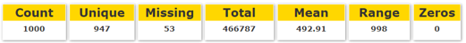

__Date Cards:__ Humanized range, start date, end date, and date format.

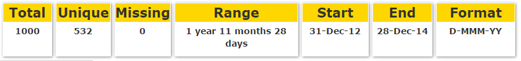

__Text Cards:__ Average word count, and average character count.

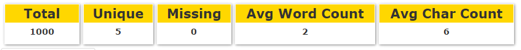

###Visualizations

Data visualization is an important component that helps sum-up the data in a way that is easy to observe and comprehend. One key distinction regarding the use of visualizations in MetaReader is that they focus on showing the shape (or distribution) of values in a data column. They are not primarily intended to provide analytical insights.

Focusing on the shape provides a user with an idea about what values are present in the data and how they are distributed. Some visualizations provide insights regarding data quality as well.

The visualizations rendered for each column depend on the data type and some other statistical measures (primarily the domain, or the number of unique values in the column). Most visualizations retain the original ordering of the data in the column, which is referred to as the index. When used, the index is always plotted on the x-axis. Using the index highlights the focus on visualizing the shape of the data. It also helps users find any point of interest (e.g. a block of missing data) in the original data file using the row number. 

####Numerical Visualizations

__Box Plot:__ A box-plot chart with minimum, maximum, first and third quartile, median and mean value. The chart also shows the number of outlier values on both sides of the chart. The chart will not be shown if there were less than 4 unique values in the data. 

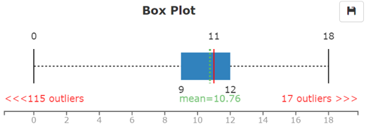

__Frequency Distribution Lollipop:__ A Lollipop (stick and circle) chart representing the frequency distributions of the values. The chart is sortable by keys (x-axis values) or frequencies. Hovering over a lollipop will show a pop-up of the key and frequency. The reason for using a Lollipop is to distinguish it from the column histogram used for binned frequency distributions. For large datasets, the lollipops are replaced with an area chart. This is because individual lollipops cannot be distinguished from each other in a dense chart. In addition, areas reduce the number of SVG elements the browser renders, which improves performance.

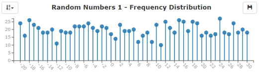

__Frequency Distribution with Bins:__ A histogram of the frequency distributions after binning (or grouping) the data values into 10 bins of equal width. 

*Bin Size=(Max-Min)/Bins…where Bins=10*
*BinStart_i=Min+Bin Size×i… for 1≤i≤Bins*

Each column represents the frequency of all the numbers in the range between the beginning of a column and the beginning of the next one. The bin start and end values are generated from the data and are not rounded. The chart will only be displayed if there are more than 20 unique values in the dataset. This will ensure that a bin will at least combine 2 values in a single bin. Using a lower threshold will reduce the value of this chart if it is shown next to the previous lollipop chart. The chart is also sortable.

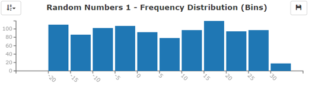

__Color Spectrum:__ This is a micro-chart that shows the individual values in the column in their original order (i.e. index). The values are color coded on a gradient from faded-green to dark green. Missing or invalid values (e.g. Null or NaN) are shown in black. The chart helps in spotting general trends and also gaps in the data quickly. For example, sorted values show as a clean gradient and cyclical data show as repeating color gradient segments.

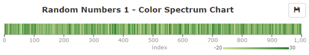
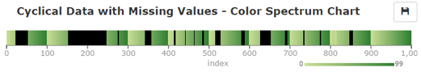

__Scatter Plot with Outliers:__  A scatter plot with the index on the x-axis and the value on the y-axis. The information it presents is similar to the spectrum chart. Although somewhat redundant, it was added because it is more familiar to users than the spectrum chart. Missing values are represented by a box with a fill pattern. The chart also highlights statistical outliers in red.

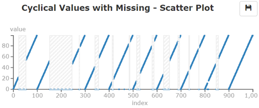
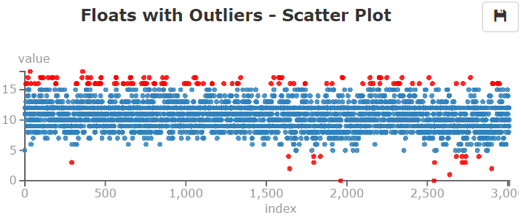

####Date Visualizations

__Frequency Distribution Time Series:__  A line chart of the frequency distribution of each date value in the dataset. The data is sorted ascendingly by date. The line chart was generated using the MetricGraphics.js library [14].

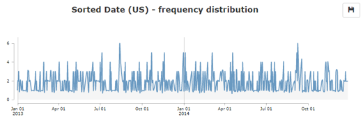

####Text Visualizations

__Frequency Distribution Lollipop:__ Similar to the lollipop chart for numbers. The only difference is that if the number of unique values (or lollipops) is 20 or less, each lollipop will have a different color. The colors use the d3 linear color scale which has 20 unique colors. The colors also mirror the colors in the spectrum chart below.

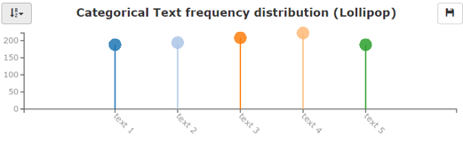

__Color Spectrum:__ Uses the same concepts of the numerical color spectrum chart above. Instead of using a gradient, this color spectrum uses the d3 categorical colors to represent each unique value. Missing values are still colored black. This chart is only rendered if the number of unique values is 20 or less. This is to avoid duplicating colors for different values when using the d3 linear scale. 

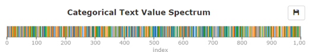

The spectrum chart also provides an additional functionality for text data. When there are many pure numerical values in the data, numerical values will be shown as light green while textual values will have different colors. This helps users identify mixed data type columns easily and take action to clean the text, if needed.

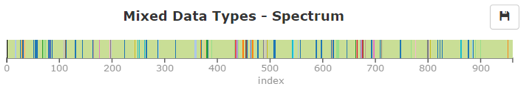

__Text Statistics Color Spectrum:__ A variation of the color spectrum. It encodes the word or character counts of each element in the column using a color gradient. A different color gradient scale was used for each chart (word and character counts) to avoid mixing this chart with the other color spectrum. 

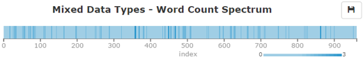
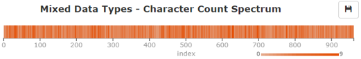

###Suggestions

One of the key features of MetaReader is that it provides tips and suggestions about the shape and content of the data in each column. These suggestions translate the numerical statistics and visualizations into potentially actionable information. All the suggestions are generated from the lists and statistics of each column. Most of them use very simple criteria but can provide very useful insights to the user. Each suggestion is also assigned a level of importance, but that information is not currently used.

The suggestions vary based on the data type of the column. All the suggestions, as the name indicates, are suggestions for the user to investigate. They represent interesting patterns found in the data. The user can hide any suggestion that is irrelevant to a given column.

Another key note about suggestions is that they are currently independent of each other. For example, if a column has only 2 unique values, two suggestions would appear: a categorical data tip and a Boolean data tip. This is done intentionally to provide the user with all the possible tips. It is left to the user’s discretion to check and then keep or hide any suggestion.

There are currently two main categories for suggestions: tips and warnings. Tips are used to highlight potentially useful information inferred from the data. Warnings highlight potential quality issues with the data (e.g. missing values).

####Date Shape Suggestions

__Missing Values:__ A warning that shows the percentage of missing or invalid values in the column. This is a data quality tip that could help identify missing or null values in a column. 

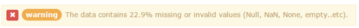

__Mixed Values:__ A tip showing the percentage of pure numerical values in a text column. This is a data quality tip that could help identify numerical columns that have “rogue” text entries. 

__Sorted Values:__ A tip indicating that the original data in this column is sorted in ascending or descending order.

__Equal Intervals:__ A tip indicating that the data values in this column increase or decrease in equal intervals. For numbers, it will show the interval length (e.g. 1). For date columns, it will show the interval and the unit (e.g. 1 hour). The algorithm for this tip is only applied on sorted columns.

__Contiguous Values:__ A tip indicating that the values in this column are contiguous (i.e. the interval between values is 1).

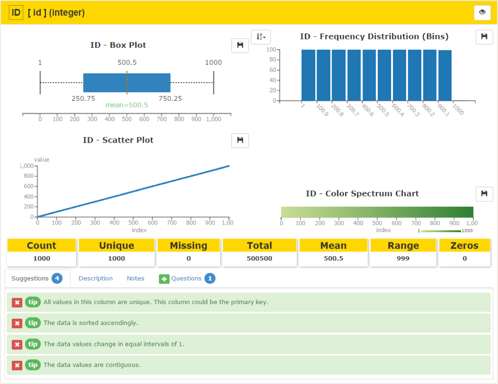

####Statistical Suggestions

__Categorical Values:__ A tip indicating that the values in the column could be considered categorical data (or dimensions) for analysis purposes. It is calculated based on the number and ratio of unique values within the column. The current threshold is 10 unique values or a 20% ratio of unique values to total count.

__Boolean Values:__ A tip indicating that the values in this column could be Boolean. It is based on a unique value count of 2. It does not validate against the actual values (0|1, y|n, yes|no, true|false, etc.).

__Primary Key:__ A tip indicating that the values in this column could represent a primary key for the dataset. It is naively based on having 100% unique values. Numerical measurements and free text values could be falsely flagged with this suggestion.

__Outliers:__ A tip showing the number and percentage of statistical outliers in numerical columns.

####Semantic Suggestions

In general, MetaReader does not look into semantic attributes of the data. This is done for two reasons. First, there is a very high variation in the semantics of the data. Second, including semantics might indicate that MetaReader is semantic-capable, which dilutes the intended focus on the shape, not the meaning, of the data.

Nevertheless, a small set of semantic tips was included to test the possibility of adding more semantic tips in the future. The implementation of semantic suggestions is both simple and extensible. 

There are two ways check for semantics. The first uses a list of potential column names that could indicate a semantic role for the data (e.g. country, city, ZIP code). A more sophisticated method uses regular expressions to validate all the values in the column against a regular expression (e.g. ZIP code, phone number). For simplicity, semantic rules are stored in a simple JSON configuration file that is parsed in real time.

__Geo-location:__ A tip based on the column name that indicates that the data in the column could represent a geographical location or coordinates (e.g. state, country, latitude, longitude).

__Date Units:__ A tip based on the column name that indicates that the data could represent a month or a year.

__Zip Code:__ A RegEx-based tip that indicates that the values could represent valid U.S. ZIP codes.

__Phone Number:__ A RegEx-based tip that indicates that the values could represent valid U.S. phone numbers.

###Descriptions

Users can add descriptions for each column in the dataset using a free entry text area. The field is intended to be used to describe the column (e.g. the semantic meaning of column data or the column’s role within the dataset).

###Notes

Users can write observational notes about a column based on the information they are presented with. The notes can also be used to write down analysis guidelines (or results if the tool is used post-analysis).

###Questions

Users can add questions or hypotheses about each column. These questions can act as guides for exploratory data analysis.

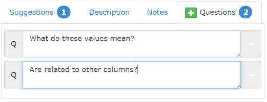

###Saving and Printing

Documentation and sharing are key design principles of MetaReader. The tool provides different ways to store the output for future use.

__Image downloading:__
All charts are downloadable as PNG images. 

__Printing:__
The tool uses CSS to provide a print-friendly output. This output can be printed to paper or to PDF files using PDF printers. The print output reduces the color variation of the background but retains chart colors. It also scales images based on the page orientation (portrait or landscape). Each column card can be printed in a separate page. Suggestions, descriptions, questions, and notes are printed under visualizations. The CSS includes rules to prevent page 

__Markdown :__<a href="#fn17" id="ref17">[17]</a>
In addition to graphic-rich output, MetaReader provides a text only output. This text output can be shared as a README file for the dataset. Using markdown adds simple and powerful styles to the file to improve readability if opened in a markdown reader without reducing readability in regular text editors.

The markdown output is focused more on the information added by the user (i.e. notes, descriptions, and questions). It also includes the suggestions the user did not hide from the interface. In general, the output does not include statistical information. In general, README files do not usually include such information. Practically speaking, a user could upload only a sample of the data for documentation purposes, in which case the statistics would be irrelevant. The only exception is the date format, which is included because it is a descriptor of a date column that could be very valuable in a README file.

__Session File:__
Session files are proprietary files in JSON format that store all the user-entered data on the tool. Its primary purpose is to provide a way to load and resume work on a dataset. Currently, the resume feature is not implemented for user sessions. It is only used for the samples. For example, the Demo sample uses a configuration file to populate human-readable column names and other user-entered data. 

###Performance Optimization

There were several performance optimizations implemented. Most optimizations were aimed at reducing RAM requirements for processing the data and rendering visualizations. 

During data processing, several value lists (e.g. clean data, sorted data, etc.) are stored as functions on the raw data instead of storing multiple copies of the data. Several tests on large sets showed that the biggest performance bottle neck was in creating and rendering SVG objects. Rendering a large number of objects (tens of thousands) in a single SVG requires a large amount of memory. Rendered SVGs stay in memory and accumulate RAM, and eventually  the browser stops working.

To overcome this issue for large datasets (too many rows, too many columns, or both), each SVG is created in the DOM and then converted to a PNG image before it is removed completely. The resulting image is then displayed in place of the SVG element. The downside of this approach is that the interactivity with the visualization can be lost. For the future, alternative optimizations to this technique will be investigated. 

##Results & Feedback

###Demo of Random Values
A dataset of random values was created to test and demonstrate the different features of MetaReader. This dataset contains different data types, value distributions, and also date formats. The demo is accessible from the samples dropdown menu.

###Testing with External Datasets
MetaReader was tested on many real datasets available online [18, 19]. Some of these datasets provided valuable insights about potential uses of the tool. Some also inspired features currently available in MetaReader. 

For example, the “Calories” dataset illustrates the use of the spectrum chart and suggestions in identifying mixed value types within a column. Several columns contained a majority of numerical data that are mixed with text. 

The “ZIP Codes” dataset is a sample of U.S. ZIP codes. The data illustrates semantic suggestions in action by identifying the geographical columns by name and validating ZIP code values. The “Schooling” dataset contains many Boolean columns that were correctly identified as Boolean. It also shows columns with mixed values.

###User Feedback
The usability of the website was tested with a very small set of users in an informal setting. The feedback was generally positive and highlighted the potential benefits and use cases for MetaReader. Several users highlighted the benefit of the suggestions component in providing useful tips and warnings about the data. Users also had positive remarks about the spectrum chart, especially in its ability to highlight data quality issues in the dataset.
There were several points made regarding the usability of the overall tool. Rendering and displaying all the charts at once was overwhelming to some users. Also, some features were not easily discoverable, such as the ability to rename cards.

There were also several comments made regarding the usefulness of some of the charts for certain data types. Some users noted that it was not clear why some charts appeared and why some didn’t for the same data type. Finally, some users expressed the need for clearer, richer tooltips, especially for visualizations.

Going forward, more formal usability testing is required to fully assess the effectiveness of the tool.

###Limitations
There are several known limitations in the current release. These limitations are being tracked and will be addressed in the future.
The tool currently can only process .CSV files. Furthermore, the library used to load the CSV values (PapaParse [8]) requires that all column names are unique.

Due to browser and memory limitations, there are limits to the file sizes that can be processed. These limits are not strictly enforced in the tool and can vary depending on the complexity of the dataset (number of columns, number of rows, number of unique values in the rows, etc.). During testing, the tool was able to render files just under 1 MB in size.

##Future Work
MetaReader is still in its early stages of development. A key step forward is to test it with a larger population to identify functionality and usability issues.

More work is required to optimize the performance for large or complex datasets. One suggestion is to use incremental rendering of charts with scrolling or pagination. 

There are some missing functionalities that could be beneficial to users such as support for other file types (e.g. Excel or TSV). There is also plenty of room to add more suggestions.  Having the resume session functionality could also improve users’ ability to share their work on the tool with other users.

Another interesting feature would be to include simple data transformation. This could include cleaning text values from mixed values columns, changing date formats, applying time-zone shifts, and converting Boolean values.

##Conclusion
MetaReader was developed to help users learn about datasets, document their questions and notes, and share their work with others. It provides simple but powerful visual and textual insights about datasets on a meta level. Those insights can help analysts jump start their EDA activities, keep track of their progress, and avoid unforeseen surprises or mistakes in their analysis. For data creators, it provides a simple way to document their datasets and create useful README files for other users.

##Acknowledgments
Many thanks to Professor Marti Hearst from the UC Berekely School of Information, and Sara Alspaugh, a Ph. D candidate in the EECS Department at UC Berkeley, for their support and guidance.  Many thanks also to fellow School of Information alumnae/i Anna Swigart and Ian MacFarland for their help in detecting and parsing date types. 

##References

1. S. Few, "Exploratory Vistas: Ways to Become Acquainted with a Data Set for the First Time," Visual Business Intelligence Newsletter, vol. July/August/September, 2011. <a href="#ref1" title="Jump back to footnote 1 in the text.">↩</a> 

2. S. Kandel, R. Parikh, A. Paepcke, J. Hellerstein and J. Heer, "Profiler: Integrated Statistical Analysis and Visualization for Data Quality Assessment," in Advance Visual Interfaces, 2012. <a href="#ref2" title="Jump back to footnote 1 in the text.">↩</a> 

3. The jQuery Foundation, "jQuery," [Online]. Available: https://jquery.org/. <a href="#ref3" title="Jump back to footnote 1 in the text.">↩</a> 

4. J.-D. Dalton, B. Bublitz, K. Cambridge and M. Bynens, "Lo-Dash: A utility library delivering consistency, customization, performance, & extras.," [Online]. Available: https://lodash.com/ <a href="#ref4" title="Jump back to footnote 1 in the text.">↩</a> 

5. "Bootstrap," [Online]. Available: http://getbootstrap.com/. <a href="#ref5" title="Jump back to footnote 1 in the text.">↩</a> 

6. Start Bootstrap, "SB Admin: A Bootstrap 3 admin theme featuring powerful jQuery plugins to extend the functionality of the Bootstrap framework," [Online]. Available: http://startbootstrap.com/template-overviews/sb-admin/. <a href="#ref6" title="Jump back to footnote 1 in the text.">↩</a> 

7. F. Gnass, "spin.js," [Online]. Available: https://github.com/fgnass/spin.js. <a href="#ref7" title="Jump back to footnote 1 in the text.">↩</a> 

8. M. Holt, "PapaParse: A powerful, in-browser CSV parser," [Online]. Available: http://papaparse.com/. <a href="#ref8" title="Jump back to footnote 1 in the text.">↩</a> 

9. E. Plaice, "jquery-csv: Parse CSV (Comma Separated Values) to Javascript arrays or dictionaries," [Online]. Available: https://code.google.com/p/jquery-csv/. <a href="#ref9" title="Jump back to footnote 1 in the text.">↩</a> 

10. I. Cambron, M. Johnson and T. Wood, "Moment.js: Parse, validate, manipulate, and display dates in JavaScript.," [Online]. Available: http://momentjs.com/. <a href="#ref10" title="Jump back to footnote 1 in the text.">↩</a> 

11. Hoodie, "moment.parseFormat," [Online]. Available: http://gr2m.github.io/moment.parseFormat/. <a href="#ref11" title="Jump back to footnote 1 in the text.">↩</a> 

12. R. Dawson, "moment-precise-range," [Online]. Available: https://github.com/codebox/moment-precise-range. <a href="#ref13" title="Jump back to footnote 1 in the text.">↩</a> 

13. M. Bostock, V. Ogievetsky and J. Heer, "D3: Data-Driven Documents," in IEEE Trans. Visualization & Comp. Graphics (Proc. InfoVis), 2011. <a href="#ref14" title="Jump back to footnote 1 in the text.">↩</a> 

14.  Mozilla, "Metrics-Graphics: A library optimized for concise, principled data graphics and layouts," [Online]. Available: http://metricsgraphicsjs.org/. <a href="#ref15" title="Jump back to footnote 1 in the text.">↩</a> 

15. E. Shull, "saveSvgAsPng: Save SVGs as PNGs from the browser," [Online]. Available: https://github.com/exupero/saveSvgAsPng. <a href="#ref15" title="Jump back to footnote 1 in the text.">↩</a> 

16. R. Scheaffer, M. Mulekar and J. McClave, Probability and Statistics for Engineers, Cengage Learning, 2010. <a href="#ref16" title="Jump back to footnote 1 in the text.">↩</a> 

17. J. Gruber, "Markdown," [Online]. Available: http://daringfireball.net/projects/markdown/. <a href="#ref17" title="Jump back to footnote 1 in the text.">↩</a> 

18. R. Sedgewick and K. Wayne, Introduction to Programming in Java: An Interdisciplinary Approach - (Booksite Datasets), Addison-Wesley, 2007. <a href="#ref18" title="Jump back to footnote 1 in the text.">↩</a> 

19. V. Arel-Bundock, "Rdatasets Github Repository," [Online]. Available: https://github.com/vincentarelbundock/Rdatasets. <a href="#ref19" title="Jump back to footnote 1 in the text.">↩</a> 

20. C. Keefer, "jquery-ajax-blob-arraybuffer.js," [Online]. Available: https://gist.github.com/SaneMethod/7548768. <a href="#ref20" title="Jump back to footnote 1 in the text.">↩</a> 

