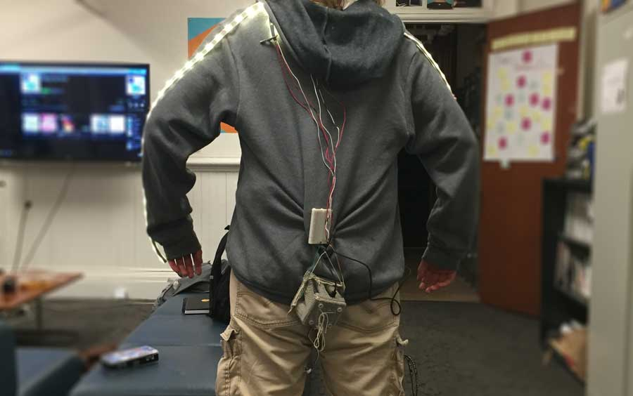
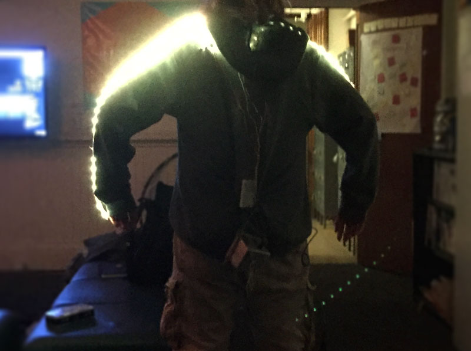
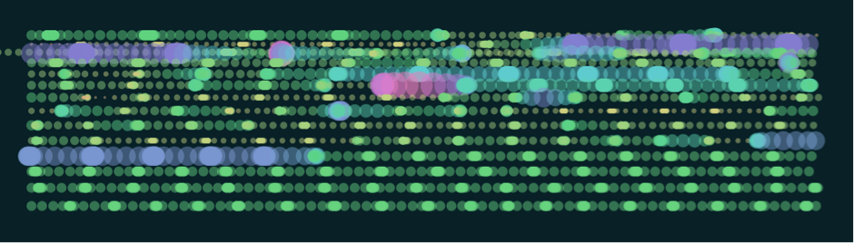
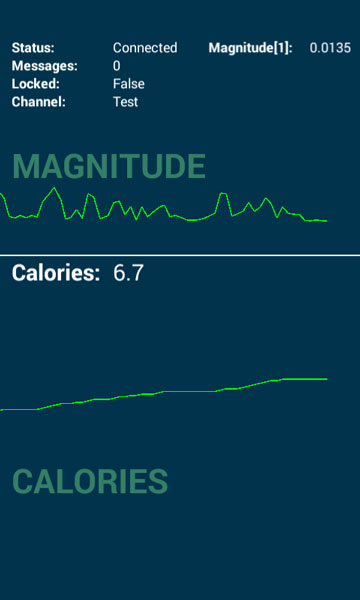

<link rel="stylesheet" href="https://maxcdn.bootstrapcdn.com/font-awesome/4.6.1/css/font-awesome.min.css">

<em>from John Chuang, Professor, UC Berkeley School of Information</em>

dance dance is a playful yet profound project. It takes the lowly accelerometer, nowadays pressed into service to quantify our daily step count, and explores its artistic potential through aesthetic expressions of performative body movements.

 

dance dance simultaneously tackles several interesting domains: wearable fashion, motion data, and the challenge of publishing streaming data between different services. It demonstrates that wearable technology can be an effective platform that fuels other creative applications. It is visually captivating in multiple ways -- between abstract data visualization, a brush with functional applications, and the light-emitting sweater itself, it suggests a bright future for wearable technology and its applications.

 

Currently, most experimental work in wearable technology exists in a silo, due to a number of technical constraints, e.g., Wi-Fi tends to have large boards, and publisher/subscriber services can be difficult to implement. By stringing together a collection of services and devices, dance dance has created an effective minimum viable product that shows promise for a platform of biosensory data. This approach to data as a platform for operations is important, because this separation of concerns between data collection and data processing/representation allows wearable technology to be much more extensible and subsequently more valuable.

 

The students confess that “the sweater was literally held together by threads…it’s a miracle it worked.” Even though this was their first experience with wearable technology and working with fabrics, the success was readily apparent. The turtle was rather cute; the jellyfish evoked spontaneous expressions of delight; even the long-exposure images of the sweater LEDs that you see here are mesmerizing. Thanks to the lowly accelerometer, dance dance has brought the audience and the dancer together in light and motion.

<a class="js-modal" data-modal-prefix-class="simple-animated" data-modal-content-id="endorsement" data-modal-title="Faculty Endorsement" data-modal-close-text="Close" data-modal-close-title="Close this modal window">Endorsed by John Chuang, Professor <i class="fa fa-external-link-square" aria-hidden="true"></i></a>

##description

Lights on the body aren’t novel in and of themselves. Especially in the realm of competitive dancing, costumes often involve bright lights that capture the line of the individual’s body in complete darkness. While this is an impressive effect, these lights are for the purpose of choreography - they are a part of a production. Inspired by this effect, however, we have developed a garment that pulls accelerometer data of an individual’s movement, and dynamically updates the LEDs’ color to reflect real-time motion of the dancer, while also wirelessly publishing this data for use in other systems. As contrasted with other takes on body LEDs, this version is dynamic and interactive, creating a new dimension of both color and expression for performance.

The sweater serves as a platform for sensor data; so, while people will have a real-time interpretation of their movements on their body, we can also create any number of third party applications that hook into the data and display or process it. For this project, we approached the paper from two angles: abstraction and extrapolation. For the former, we created a visualization of a jellyfish, which can be projected or displayed on a nearby screen to have real-time visual feedback. For the extrapolation, we built a smartphone app that directly visualizes the accelerometer data and displays accompanying calorie information.

Our goals were primarily to produce a minimum viable product (MVP) and to do some preliminary testing of our concept and its feasibility.

##process
 
###platform

The production process for the sweater was focused on delivering immediate feedback to the user and pushing the data in real-time to other devices. These considerations shaped our development process in a number of different ways, specifically allowing us to stay on task and not fall down too many rabbit holes, of which there were far too many.
We initially started working with the Particle Photon, which we felt would meet our goals most effectively because of the built in WiFi and small form factor. Yet despite the benefits of this device, we ended up not using it in our project because of two main factors: 1) difficulties connecting to the UC Berkeley network and 2) difficulty with header files. Many of the libraries associated with the different technologies we leveraged had pre-built header files, but they all assumed that we would be using an Arduino as the microcontroller (as opposed to a Photon). Since the libraries assumed we would be using an Arduino it meant we would have to rewrite all of the headers and potentially the libraries in order for the code to work. This seemed out of scope because of our limited C++ knowledge. Additionally, we were unable to get the Photon to connect to the UC Berkeley networks, even CalVisitor, which also limited the viability of the Photon for this project. Subsequently, we opted to use an Arduino Zero with a WiFi shield.

Using the Arduino Zero allowed us to focus on the development of our project as opposed to fighting with the other technologies we were using. We then followed a straightforward process in terms of software development, connecting each component of the system (WiFi/PubNub, accelerometer, LED lights) and ensuring that they worked independently. Afterwards we started connecting the technologies together, first the accelerometer and the WiFi, ensuring the Serial output matched what we were publishing to PubNub. Next we connected the LED lights and the accelerometer to ensure that the lights represented the data we were outputting. We wanted there to be a baseline illumination for the LED lights (as opposed to not lit up at all) but, because we were passing the accelerometer data, the LEDs barely lit up. We created a multiplier that we applied to the accelerometer data before it was passed to the LEDs, as well as a saturation point, so that the LEDs were using the accelerometer data in real-time but also had a baseline illumination. Additionally, we tested the publishing system with the smartphone application and jellyfish visualization to ensure that all parts of the system were synced before attaching the system to the sweater.

We began by building our platform, which was a sweater with LEDs sewn onto the sleeves, and a small shell on the outside with an Arduino Zero and WiFi shield - referred to as the “turtle” for its similarity to a small turtle shell (see Figure 1). As we began to build the system of LEDs and associated hardware into the sweater, however, we did some basic analysis of people’s dancing habits. We noticed that people often put their arms up, exposing the bottom of the forearm; in our sample, men tended to spread their elbows out horizontally, while women tended to pull them down, creating a more vertical line. Ultimately, we sewed the LEDs on the bottom part of the forearm for maximum visual effect, and placed the “turtle” (explained below) on the small of people’s backs in order to minimize the movement to which it was subjected. Once everything was complete, the basic system was that the Arduino received data from the accelerometer, relayed them to the LEDs, and published the data over WiFi using the PubNub system. So, while the garment worked as an independent system, it was also a data source for any person or application with a subscription.

__Figure 1__

 

 
 
###abstract visualization

For the abstract visualization, the initial development involved reviewing information from the fourier transform and low pass filters, and mapping parameters from the movement to visual parameters (such as color, motion, shape). This also involved a review of abstract visualizations made with JavaScript frameworks for inspiration, and eventually we settled on the idea of a jellyfish, for both its playfulness and its tentacles, which echo the swaying line of LEDs on the sweater platform.

We wrote the jellyfish animation using a popular JavaScript animation library, and by looking at a reference from videos of jellyfish and translating it into sinusoidal motion through trial and error. The jellyfish swims up the page, and translates to the right when it resets. The jellyfish leaves a trail of translucent bubbles, which we decided upon after testing different types of trails (jellyfish bodies, lines left by the tentacles). Once the jellyfish animation was complete, we integrated the signal magnitude data from the sweater. We mapped the magnitude to the speed of the jellyfish, and the size and color of the bubbles, after trial and error getting the right parameters (see Figure 2).

__Figure 2__

 

 
###smartphone application

The smartphone application was made in parallel with the platform, with early testing being done with the standard accelerometer on the phone. Conceptually, this was meant to be a more pragmatic application of the data transforming the accelerometer into something that would be useful or meaningful to users. While we enjoy the abstraction of both the sweater’s LEDs and the jellyfish’s trail, some of our prior (unpublished) work indicates that accelerometer data can be invaluable to the person who owns it, providing interesting information about their dancing patterns.
The app serves as a proof of concept, showing that we can extract the data from the Pubnub and let a mobile app use it in real-time. The prototype shows two useful analytics of dancing sessions: the number of calories burned and the average magnitude of all the accelerometers that are connected through the subscriber node. The app was made with the multiplatform Corona SDK, and so it’s very easy to build it for iOS as well. An Apple developer account is required to make it run it on other devices, though.

 

###deployment

Although we haven’t done open testing of our platform, we have presented our work to a community of individuals interested in the field of human-computer interaction and biosensing. Their reviews have been generally positive, however, we require further validation around the conceptual strength of our concept, the implementation of it, and the potential applications of this technology in the world.

##implications

While the system has not yet been subjected to formal experimentation, preliminary use suggests that the wearable device has the potential to create statistically significant results. In particular, the sweater augments the user’s:
self-expression

While our preliminary interviews about dancing suggested that arms were static, and most motion came from a person’s hips and legs, putting on the sweater drew people’s attention to their arms, where the LEDs were. Their arms became a much more intentional part of their motion, and there was much higher involvement of the upper body (swaying, and waving of the arms.) This also relates to...

###mind[ful/less]ness about the body

As people moved, they began to consider their movement(s) more thoughtfully, engaging with space in new ways. In particular, men and women both tended to bend their arms at the elbows, and then tuck in their extremities when they danced, shrinking their upper body. With the sweater on, they were much more likely to open up their posture. This might indicate the sweater creating a more mindful (or mindless) interaction with space and the body.

Additionally, this system is delightful for both viewers and wearers. While there is obvious risk that this is purely a novelty effect, putting on the sweater is a full spectacle; the dancer begins to take up space, but we’ve found that audiences appreciate this. While wearing the system, people dance and laugh, and while watching, audiences seem fully engaged in the spectacle of the sweater, the abstract visualization, and (perhaps surprisingly) even the smartphone application. The correspondence between the three data sources provides three starkly different ways of engaging with the data. This might be seen as overwhelming for applications that require focus. However, for casual entertainment, users seem to find it to be a lot of fun.

<iframe width="420" height="315" src="https://www.youtube.com/embed/bL1m3qB3qgw" frameborder="0" allowfullscreen></iframe>

##recommendations

We have a number of issues to address moving forward, including the hardware used for the sweater, improvements and additional features on the jellyfish animation, as well as more rigorous algorithms running on the smartphone application.
Another difficulty we encountered was the latency of data transmission. The Arduino sends the accelerometer readings every half second, rather than attempting to get a more granular signal. Furthermore, the Arduino WiFi shield has some major limitations; every few seconds the shield needs to refresh its TCP handshake with the wireless network. This creates pauses in the color change of the LEDs and the jellyfish. The Android app uses the time difference between datapoints to determine a graph’s x-axis values, which resulted in distorted visualizations. In each chunk of messages, only one message had a time difference of 0.5 seconds, while the rest was closer to 0 milliseconds. Since we know the publication rate of our platform, we fixed this by setting the timing to be equal to its inverse for each message – a reasonable assumption that significantly improves the results. Since the app is not meant for real-time monitoring, the delay is negligible and does not have a negative impact on the usefulness of the app.

With the basic concept validated, however, we see potential applications in the following:

###physical therapy

The entire platform is fun and engaging, but could provide some rough approximations that are useful for clinical applications. For example, while testing range of motion, the accelerometers simply capture data from the target area, and the LEDs help patients and caregivers better understand whether the motion is in the appropriate range. This could be calibrated to individuals and body areas, and ultimately provides a more engaging physical therapy experience at a fairly low cost. Additionally, since the data is being published, it could be stored (to create a historical record) and processed through media such as the abstracted visualization to better explain what the therapy is intended to accomplish. For example, it’s quite easy to tell a small child that they’re trying to get the jellyfish and the lights on their arm to turn bright turquoise. It’s more complicated, however, to explain that you’re trying to elicit an acceleration whose overall magnitude is within a specific range.

###visual & performing arts

Even as an MVP, the visual effect of the sweater is striking, creating a long and dramatic line along the body that flickers between colors. In the context of interpretive dance, it could help to accentuate a dancer’s motions, or even abstract away from the dancer himself/herself - in a dark room, the individual becomes invisible, while the line stays bright. The combination of form and color, in combination with algorithmic patterning, could create compelling performances in the right hands.

Additionally, we found that long exposure photography (which involves a slow shutter speed in the order of seconds) of the sweater creates interesting compositions (See Figure 3). The trails of light left behind are quite dramatic, and also fairly unique. There are a multitude of opportunities for artistic expression, like a visual representation of different dance styles, or photo profiles of an individual’s motion while they wear the sweater.

###entertainment & fashion

Without the LEDs, the addition of music fingerprinting technology could help people curate playlists in a passive set-it-and-forget-it manner. Individuals could dance for an entire night, and check their phone the next day. All the songs you danced to were captured, and you could sort the songs by your own dancing intensity. Assuming the intensity of your dance correlates with your enjoyment of the song, you can easily add your favourite songs to Spotify without ever having to pull out Shazam during your best moves.
