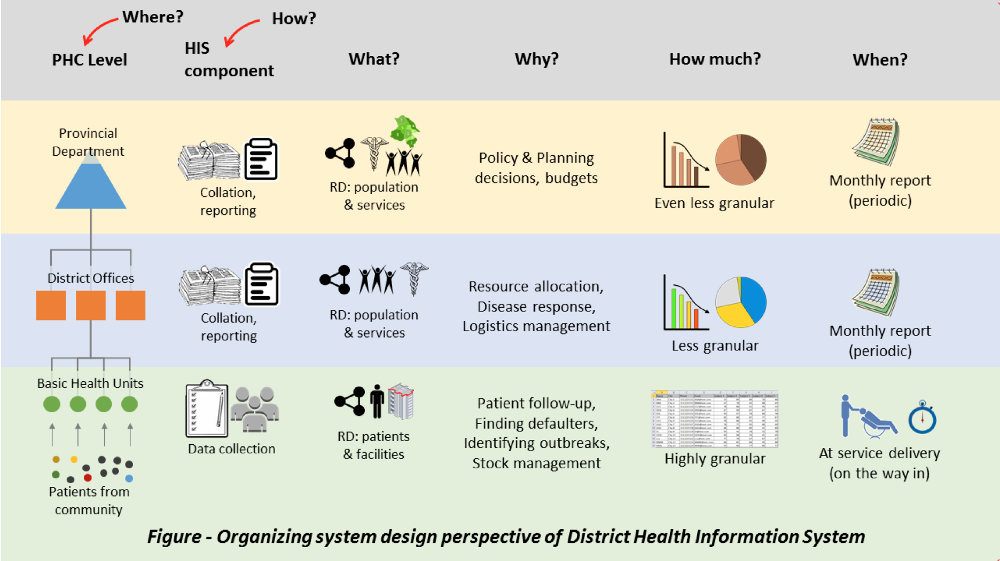

<button class="js-modal case-study" data-modal-prefix-class="simple-animated" data-modal-content-id="explanation" data-modal-title="What's a 'Case Study'?" data-modal-close-text="Close" data-modal-close-title="Close this modal window">What's a 'Case Study'?</button>

<a href="http://disciplineoforganizing.org/">The Discipline of Organizing</a> is a textbook used in many iSchools for courses in Information Organization, Knowledge Management, Digital Collections, Information Architecture, and related fields. The book proposes concepts and methods that unify the perspectives of different disciplines regarding the organizing of physical and digital resources. Everything is organized, but organizing systems differ in purposes, in the resource properties and organizing principles they use, when the organizing takes place, and the methods by which it is carried out.

Chapter 11 of the textbook features case studies that explain how these design decisions that collectively define an organizing system are interconnected, and how resource descriptions and organizing principles determine the number and nature of the interactions with resources or sets of resources. Explaining this “traceability” of the decisions in the organizing system that is analyzed or designed is the essential requirement that should be satisfied by each sophisticated case study.

Featured here are a few interesting case studies that illustrate the generality of the organizing system idea.

The primary health care network in Pakistan consists of more than 13,000 health facilities  including Basic Health Units and dispensaries, both of which provide primary care services to the masses. The network represents one of the largest service delivery systems in the country.

The information produced and processed by the network is formally organized by a District Health Information System (DHIS). The DHIS is organizing three types of resource descriptions (see Figure 1). First is the individual health and disease data (resource description) of every patient (primary resource) that comes in contact with the system. Second is the service delivery and administrative information of each health facility (a resource description of each facility). Third are the statistical summaries and reports that are generated through collation and analysis of the first two. These summaries, however, are not descriptions of individual patients but instead represent resource descriptions of whole segments of population (resource).

__Figure 1__

Information collected at health facilities<a href="#fn1" id="ref1">[1]</a> during patient encounters is recoded manually into different tools such as Outpatient Register, Maternal Child Health Register, Prescription forms, etc. At the beginning of every month, the staff manually prepares a monthly report ([sample](https://www.scribd.com/document/333129181/DHIS-Monthly-Reporting-Form-PHC-Facilities)) of the previous month summarizing the patient flow, disease conditions observed, stock details of drugs and other consumables, etc. This report is delivered to the District Office by the 5th of the month. At the district office, a Data Officer enters the reports into a DHIS software (developed by JICA <a href="#fn2" id="ref2">[2]</a>). The digital form of the report is then transmitted to the Provincial Health Department by the 15th of the month. This is where all of the district reports are combined into a single, state-level report, which in some provinces is published online <a href="#fn3" id="ref3">[3]</a>.

The goal (or why) of organizing these resource descriptions is to enable meaningful interactions for health facility managers, district health officers and policy makers at state level. At the facility level these are simple interactions such as finding patients in records who missed their vaccination date, or drug and stock management. The district and state levels utilize more complex interactions of the system such as identifying disease patterns, making public health decisions, measuring service utilization and quality, and making budgetary allocations for future.

How much the resources are organized varies by level. At the health facilities, the information is most granular – i.e. individual details of each patient and service delivery event are recorded. However, at the district, provincial and national levels, progressively summarized information is organized in the form of monthly reports. A seemingly mundane decision about what the monthly report should look like leads to category design issues. As disease patterns evolved over time, the originally defined categories of diseases are no longer sufficient to capture the required level of granularity. However, changing a reporting format that has been in use for 30+ years will inevitably lead to challenges of maintaining compatibility with historical data.

When: Resource descriptions at the facility level are organized as they are created (point of contact). However, at higher levels of the system, information is organized in a delayed and periodic fashion by employing the monthly reporting scheme. At all levels, this can be considered on-the-way-in organization because, in almost all cases, this information is retrieved only later when needed for decision making.

How the resources are organized involves a set of tools (paper-based registers and electronic databases), as well as concerned data entry staff and data managers at each level. Final summary statistics at provincial and national levels may be produced by software. The historical decision to employ paper-based tools at the health facilities has had important implications. A time-sensitive interaction required is the emergency notification of outbreaks of highly contagious diseases. The absence of digital data collection at point of care makes this interaction very slow and ineffective. Some provinces have adopted mobile phone-based tools to address this challenge.

Regarding location, the original paper-based records (resource description) of patients’ interactions with the health system are always stored at the concerned health facility, and only a monthly summary report is sent upwards. The collated reports are stored in paper form at district offices, entered manually into a digital system, and transmitted to provincial offices in digital form.
An overarching challenge is the lack of interoperability with other systems. Disease categories were defined by the government for Pakistan’s systems but another weekly reporting system (DEWS) employed by the World Health Organization classifies diseases differently. Vertical disease controls and community services funded by international agencies also created their own categorizations. None of these follow the ICD scheme, and thus international comparability is even more challenging. This is a classic example of incompatibilities in abstraction and granularity causing interoperability challenges.

A related issue is the limited use of data for policy and planning. One of the reasons for this could be that the presentation tier of the system is poorly designed and does not afford easy interpretation and intelligent decision support.

Another challenge faced by DHIS is where it intersects with other organizing systems. The human resource in health facilities was organized for service delivery and data collection for the essential services. As years progressed, new programs for Polio Eradication Initiative and Disease Early Warning System, etc. were implemented by assigning these tasks to the same human resource. This overburdened the staff so much that completing data entry for all these systems was difficult, and the quality of data suffered greatly. Solutions would, therefore, include either providing dedicated human resources for data collection or making the data collection highly efficient.

###References

1. National Integrated Feedback Report 2013. World Health Organization and DHIS Pakistan. <a href="#ref1" title="Jump back to footnote 1 in the text."> go back ↩</a> 
2. The National Action Plan for the Improvement of Health Information Systems in Pakistan. Japan International Cooperation Agency and Ministry of Health, Islamic Republic of Pakistan. Feb 2007. <a href="#ref2" title="Jump back to footnote 1 in the text."> go back ↩</a> 
3. Online published reports of DHIS KP at: http://www.dhiskp.gov.pk/reports.php  <a href="#ref3" title="Jump back to footnote 1 in the text."> go back ↩</a> 

