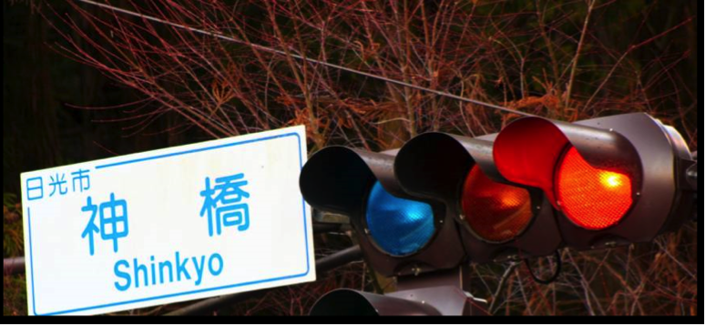
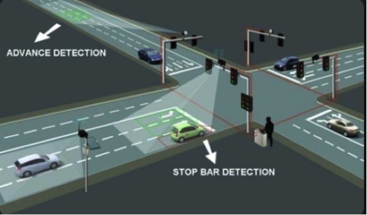
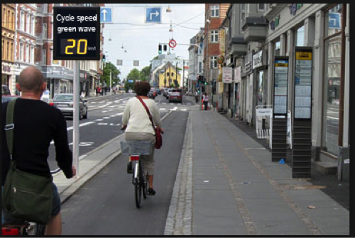
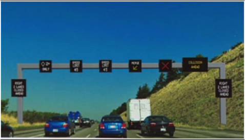
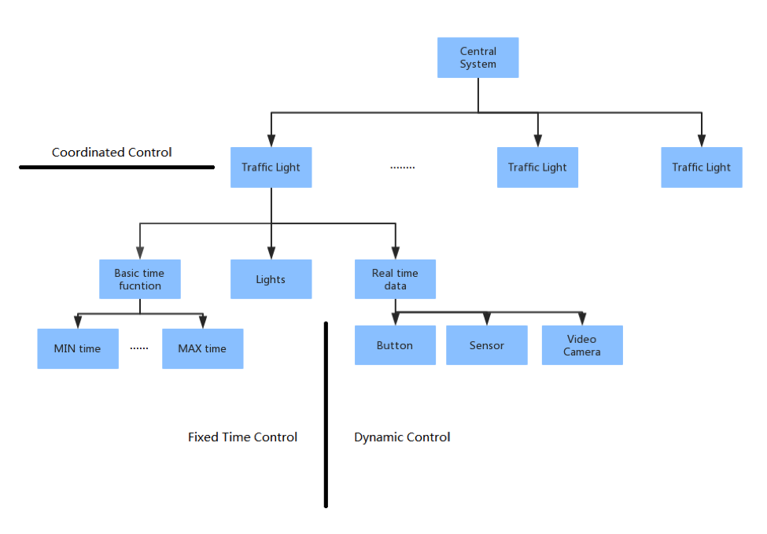
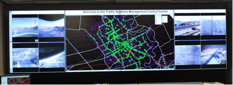

<button class="js-modal case-study" data-modal-prefix-class="simple-animated" data-modal-content-id="explanation" data-modal-title="What's a 'Case Study'?" data-modal-close-text="Close" data-modal-close-title="Close this modal window">What's a 'Case Study'?</button>

<a href="http://disciplineoforganizing.org/">The Discipline of Organizing</a> is a textbook used in many iSchools for courses in Information Organization, Knowledge Management, Digital Collections, Information Architecture, and related fields. The book proposes concepts and methods that unify the perspectives of different disciplines regarding the organizing of physical and digital resources. Everything is organized, but organizing systems differ in purposes, in the resource properties and organizing principles they use, when the organizing takes place, and the methods by which it is carried out.

Chapter 11 of the textbook features case studies that explain how these design decisions that collectively define an organizing system are interconnected, and how resource descriptions and organizing principles determine the number and nature of the interactions with resources or sets of resources. Explaining this “traceability” of the decisions in the organizing system that is analyzed or designed is the essential requirement that should be satisfied by each sophisticated case study.

Featured here are two interesting case studies that illustrate the generality of the organizing system idea.

####What is being organized?

Traffic lights are something we see every day. Actually, one single traffic light in a given crossroad is already a unique organizing system because every single traffic light has its own particular resources. 

Basically, every traffic light system needs to organize basic timing functions. For example, MIN time determines the minimum duration of the green interval for each cycle. Left turns, right turns, minor streets, and major streets all usually have different MIN times. MAX time limits the maximum time of the green interval. Like MIN time, it is also different for different conditions. Moreover, within the technology of sensors, MAX times are sometimes dynamically adjusted to the real-time traffic loads.
Besides the timing functions, traffic light systems also need to organize other resources. Sometimes even the description of the same resource can be different.  Although we usually assume that the colors of all traffic lights are green, yellow and red, they can also be, and sometimes are, different. In Japan, for example, due to cultural and historical factors, green lights are sometimes actually blue. Due to lexical perspectives in Japan, “green” lights are not called 緑 (みどり) – the Japanese word for “green” – but 青 (あお, blue). 

__Figure 1: Traffic lights in Japan__

Nowadays, while more advanced methods have been employed – for example, button input, video cameras and sensors – traffic lights are sometimes centrally controlled by monitors or computers, which  allow them to be coordinated in real time to deal with changing traffic patterns. Thus, it is required that the traffic light systems can organize many different real-time data inputs. 

__Figure 2: Traffic lights with sensors__

####Why is it being organized?

The traffic light system was invented to ensure the order of traffic and the safety of drivers, passengers and pedestrians.  Thus, during the design of the system, a timing function is highly required to handle different conditions and actual traffic situations.  Without any doubt, it should organize the resources to ensure there will be enough of a time interval to let vehicles and pedestrians go through safely without collision.
Furthermore, as they face more and more heavy traffic, people require the traffic light system to organize its resource efficiently and effectively in order to present more benefits and capacities such as increasing the traffic handling capacity of roads, reducing collisions and waiting time for both vehicles and pedestrians, reducing driver frustration and road rage, and relieving the serious situations.  “Green wave” is a very good example.  It is a series of traffic lights (usually three or more) that are coordinated to allow continuous traffic flow over several intersections in one main direction. This allows higher traffic loads, and reduces noise and energy use. More than that, it is also used to limit speed in some countries, such as Germany. One car can go through the intersection without any stop when their speed is lower than the speed limitation. Moreover, the traffic light system could even interact with the function of the lane. “Dynamic lane use” enables the traffic light system to adjust the lane function to go-through, left-turn or even be closed for this direction but open for another one. The traffic light intends to utilize effectively the limited space to maximize the traffic loads.  Thus, the traffic light systems are required to organize more complex data.

__Figure 3: Green wave for bicycles__   

__Figure 4: Lane use control on a highway__    

####How much is it being organized?

Right now, there are mainly three types of control methods of traffic lights, which thus determine different principles to be used to organize the system and categorize the resources. The basic control method is fixed time control. It uses fixed, signalized intersection time plans. All related resources are pre-defined and do not frequently change in the system. Meanwhile, in fixed time control, each traffic light  is a single, independent, isolated system that does not require either intra-system interactions or outer-system interactions.  The second method is dynamic control, which uses input from sensors or humans to adjust signal timing. For example, some traffic lights at pedestrian crossings have a button for pedestrians to press in order to receive green lights for walking. Dynamic control allows a real-time interaction from outside the system to change its internal value or resource. The last method is coordinated control. Attempts are now often made to place traffic signals on a coordinated system that enables the central computers or monitors to coordinate several traffic lights to handle different real-time changing traffic patterns according to the input from sensors or video cameras. For example, adaptive signal control could resolve the issue that the driver has to wait for the green light while the intersection is actually empty. With the data from the sensors, the control computer could adjust the timing signal to improve traffic flow. In coordinated control, it enables intra-system interactions to allow the data from sensors to be processed together to provide an optimization plan and then alter each related traffic light’s resources.

__Figure 5: Organizing Hierarchy__

####When is it being organized?
Most of the resources are organized when the traffic light is established. For example, the basic timing functions and the signals. However, for some resources, it is an on-going process. To handle the button input of pedestrians, the input signal is organized immediately to process and to prepare for activating the change of the signals. It alters the value of the timing functions. However, when the pedestrians have finished crossing the street, the signal of the button is reset and the value of timing functions is changed back to the default. For these inputs from sensors, they might require advanced processing and computation. Thus, the system would maintain and compute these data to generate a reasonable plan that finally changes the signals. 

####How or by whom is it being organized?
Right now, due to the development of infrastructure and communication, most traffic lights in developed cities are controlled by a central computer system. For example, in New York City, over 60% traffic lights are controlled by the central computer network.  Other out-network traffic lights become independent systems to be self-organized but maintained by the local government. 
 
__Figure 6: An example of a central control system__

####Other considerations?

With the development of technology, traffic lights are becoming smarter and smarter, and playing ever-more important roles in peoples’ daily lives. However, traffic lights might not be necessary in the future because incoming technologies such as self-driving cars might eliminate the need for a traffic light system.  These (semi-)autonomous cars do not demand visible lights to guide them because they can drive automatically and interactively to ensure safety and speed without the assistance of traffic lights.  
