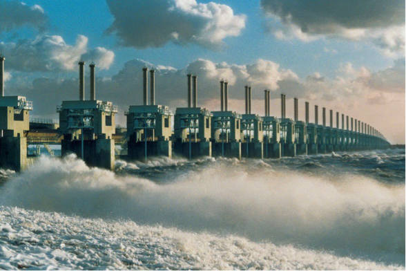
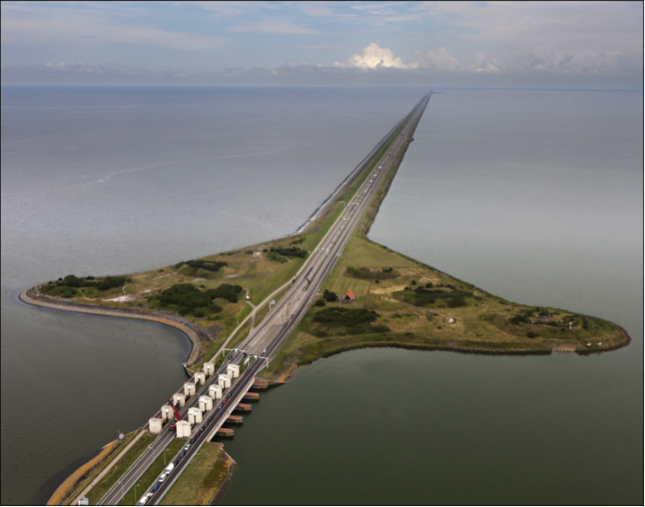
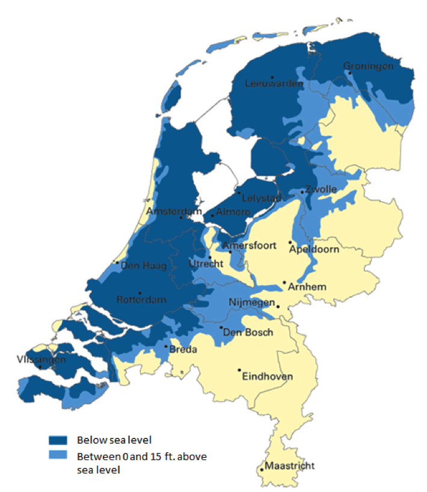

<button class="js-modal case-study" data-modal-prefix-class="simple-animated" data-modal-content-id="explanation" data-modal-title="What's a 'Case Study'?" data-modal-close-text="Close" data-modal-close-title="Close this modal window">What's a 'Case Study'?</button>

<a href="http://disciplineoforganizing.org/">The Discipline of Organizing</a> is a textbook used in many iSchools for courses in Information Organization, Knowledge Management, Digital Collections, Information Architecture, and related fields. The book proposes concepts and methods that unify the perspectives of different disciplines regarding the organizing of physical and digital resources. Everything is organized, but organizing systems differ in purposes, in the resource properties and organizing principles they use, when the organizing takes place, and the methods by which it is carried out.

Chapter 11 of the textbook features case studies that explain how these design decisions that collectively define an organizing system are interconnected, and how resource descriptions and organizing principles determine the number and nature of the interactions with resources or sets of resources. Explaining this “traceability” of the decisions in the organizing system that is analyzed or designed is the essential requirement that should be satisfied by each sophisticated case study.

Featured here are two interesting case studies that illustrate the generality of the organizing system idea.

##Overview 
In a time of global warming and rising sea levels the Netherlands faces a hard ordeal. Three of Europe’s biggest rivers debouching into the sea, and already half of the country and the homes of 10 million people are below sea level. Survival would be at stake, if the country didn’t have a highly advanced water management system.

##What is being organized? 
The primary resource being organized in this system is the water in the Dutch rivers, canals, lakes and ditches, as well as the sea water around the Dutch coasts. To be able to do so, other resources are added to this originally natural system, namely about 200 miles of dikes and dams, 70 weirs, 4 immense flood barriers and countless pumps. By using sensors, cameras and human checks, digital information about them is entered into the system. This information is used to build models and calculations that directly influence the physical resources, making the system an integrated mixture of physical and digital resources. 

By rainfall and snowmelt throughout Europe, the rivers are fed with new water constantly, while storms and ocean currents influence the sea level, causing a continually change in resources. At the same time, digital interaction resources are created through ongoing interactions between the water and the measurement resources.

##Why is it being organized? 
In the first place, the system is designed to disable the water from flooding the country and drowning the Dutch citizens, which makes preventing an interaction the main goal of the system, a social goal. This social goal is institutionalized, since the government took over the responsibility of interacting with the system.  

As the main resource of life, water supports many interactions. Therefore, the government distinguishes two other goals for this system. One is an economic goal to provide a valuable infrastructure for the shipping industry by dredging the rivers and seabeds and digging canals to industrial areas. Another goal is to facilitate natural and recreational uses like preserving and supporting plant and animal habitats of the historical Dutch landscape, as well as ensuring water quality, all while building new artificial resources to maintain the system.

##How or by whom is it being organized? 
The Ministry of Infrastructure and Environment has given the governmental institute ‘Rijkswaterstaat’ the special task to manage this water system and its resources. It maintains the system by dragging and strengthening the dikes and it controls the flood barriers, weirs, interactive pumps and even movable dikes. These actions enable Rijkswaterstaat to manipulate the exact location of all the water, making this one of the biggest human-controlled, physical organizing systems in the world.

Two prestigious examples of these operations are the ‘Afsluitdijk’ and the ‘Deltaworks’. The ‘Afsluitdijk’, in the north of the Netherlands, is a 20-mile weir and road that controls the water level of a large part of the North Sea by separating it from the open sea and therefore turning it into a lake. The ‘Delta works’, a construction of flood barriers in the south of the Netherlands, can close the entire delta of the Rhine and Meuse rivers in case of exceptionally high sea levels. In this way it controls the water levels of the last part of these rivers and allows the river dikes to be tens of feet lower.

Decisions about the organization of the water, by physical manipulation of the resources, are made by professionals, supported by advanced computer methods and algorithms that also partially organize the system automatically. Weirs close automatically and pumps that regulate the groundwater level react directly to sensor information, which minimizes the need for interpersonal contact and the risk of human mistakes. 

Another important organizer of the system is Mother Nature. The climate interactions are purely physical and consist of adding resources by letting water flow into the rivers, varying the sea levels and affecting the artificial resources.

Unique is the fact that the Dutch citizens do not directly interact with the system, which is very different from other cities and countries that are vulnerable to water floods such as the Maldives, Venice and New Orleans. In these regions the governments have created fewer possibilities to interact with the water system, unfortunately resulting in more enabled interactions for their citizens and their homes. Besides users (or victims) of the system, the citizens of those areas are still organizers by actively protecting their homes with improvised dikes. 

##How much is it organized? 
Water is a liquid resource, and no specific unit can be uniquely identified, which makes digitization harder and models more vulnerable to uncertainty. To measure the resource, water is geographically categorized into open water and groundwater under land areas. The open water is further divided into the different seas, rivers, lakes, canals and ditches, and, in each of them, with different granularity, the difference in centimeters with the regular water level in Amsterdam, the so called “Normaal Amsterdams Peil” (NAP) level is tracked. Their precise measurement system allows Rijkswaterstaat to track these water levels on a scale of a squire meter in critical areas. Combined with detailed knowledge about the water quality that is stored, this empowers the required high level of interoperability with the system that provides drinking water in the Netherlands.

The great importance of the persistence of the man-made resources results in detailed data about its maintenance. Since preventing interactions is the main goal, the maintenance phase is the most important part of the systems lifecycle. 

Another form of interoperability, due to the high level of organization and description of the resources, can be seen in the landscape architecture of the country. Human-controlled natural resources serve as protection against the water where possible. Low playgrounds and recreational lakes are created in villages to capture water in rainy seasons, which reduces the need for pumps that prevent basements from flooding. 

##Where is it being organized? 
Rijkswaterstaat is located in the city of Rotterdam. The water management system itself is controlled from Lelystad, a city built on land reclaimed from water; the system’s main servers that contain the informational resources are also located here. Throughout the country, local departments, external parties and local governments collaborate to execute the system’s processes and maintenance. 

In a European collaboration with, among others, neighboring countries Germany and Belgium, the Netherlands participates in a network of interoperable water management systems to control the flow of the rivers and exchange related climate information. One example that highlights the importance of the collaboration is the port of Antwerp, Belgium’s largest port, which is deprived of international access if the Netherlands closes the flood barriers of the ‘Deltaworks’.

##When is it being organized? 
The Dutch war against water started in about 500 BC, when the first permanent inhabitants of this fertile sea-deposited clay protected themselves against floods by building their homes on artificial dwelling hills. The first dikes and even the first rerouting of rivers date back to the Roman invasion in the first centuries. The famous Dutch Windmills were introduced as predecessors of the current electric water pumps to dry wet fields and reclaim water from rivers and the sea for agricultural use in the late Middle Ages. The foundation of Rijkswaterstaat in 1798, and the Kingdom of the Netherlands in 1813, resulted in the first nationwide water management system.

Today’s highly-advanced organizing system dates back to the beginning of the 20th century, when rising sea levels caused an increased number of floods. The ‘Afsluitdijk’ was built to stop the ocean from claiming land. 1953 was the last time a big flood afflicted the Netherlands, killing 2000 people and taking about 100,000 homes. This flood triggered the largest renovation of the system and the building of unprecedented flood protection projects such as the ‘Deltaworks’.

Nowadays, digital interactions enable a more detailed organization of the system than ever before. And with the constant supply of resources and a changing environment, organization takes place every second to keep the water away and extend the maintenance phase of the system’s lifecycle forever.

##Other Considerations
Rising sea levels are not only a problem for the Netherlands. It is a worldwide threat with important consequences for different cities and countries. The table below compares the differences and similarities in the level of action various governments have taken to create a water management system and the response of citizens’ interactions with these systems. 

|                                         | The Netherlands                                                                                             | Venice                                                                                                                                                                                                                                                     | The Maldives                                                                                                                                                                                                                                                                                                                                                       | New Orleans                                                                                                                                                                                             |
|-----------------------------------------|-------------------------------------------------------------------------------------------------------------|------------------------------------------------------------------------------------------------------------------------------------------------------------------------------------------------------------------------------------------------------------|--------------------------------------------------------------------------------------------------------------------------------------------------------------------------------------------------------------------------------------------------------------------------------------------------------------------------------------------------------------------|---------------------------------------------------------------------------------------------------------------------------------------------------------------------------------------------------------|
| __Surrounded by:__                          | Sea: North Sea Rivers: Rhine, Meuse, Scheldt and Eems                                                       | Sea: Mediterranean Sea Lagoon: Venetian Lagoon                                                                                                                                                                                                             | Ocean: Indian Ocean                                                                                                                                                                                                                                                                                                                                                | Lake: Lake Pontchartrain Sea: Gulf of Mexico River: Mississippi                                                                                                                                         |
| __Above sea level:__                        | Average: 16 ft.                                                                                             | Average: 57 in .                                                                                                                                                                                                                                           | Average: 4 ft. 11in. Maximum: 7 ft. 10 in.                                                                                                                                                                                                                                                                                                                         | Average: 6 ft. below sea level Maximum: 20 ft. above sea level                                                                                                                                          |
| __Special:__                                | Country with largest part of its land under sea level, while having one of the highest population densities | High historical importance. The city sinks about half an inch every year.                                                                                                                                                                                  | Lowest country of the world, famous for its coral islands.                                                                                                                                                                                                                                                                                                         | Vulnerable for Hurricanes and still sinking.                                                                                                                                                            |
| Man-made protection resources:          | Dikes dams, weirs, flood barriers and pumps                                                                 | Port dams separating the Venetian Lagoon from the sea.                                                                                                                                                                                                     | Small dikes                                                                                                                                                                                                                                                                                                                                                        | Pumps and dikes.                                                                                                                                                                                        |
| __Under construction:__                     | -                                                                                                           | MOSE flood barrier. Separates the Venetian Lagoon from the sea.                                                                                                                                                                                            | -                                                                                                                                                                                                                                                                                                                                                                  | IHNC Lake Borgne Surge Barrier. Closes the water ways of Lake Pontchartrain in the north and the Gulf Intracoastal Waterway on the west side of the city                                                |
| __Last flood:__                             | 1953                                                                                                        | 2012                                                                                                                                                                                                                                                       | 2016                                                                                                                                                                                                                                                                                                                                                               | 2016                                                                                                                                                                                                    |
| __# floods in past 10 years:__              | 0                                                                                                           | 5                                                                                                                                                                                                                                                          | 12                                                                                                                                                                                                                                                                                                                                                                 | 2                                                                                                                                                                                                       |
| __Citizens reaction to flood:__             | No interactions between citizens and the water.                                                             | Getting used. Place special plates in the door frame and clean their home after the flood.                                                                                                                                                                 | Escape to higher places and leave the islands. Often move to other islands after the flood.                                                                                                                                                                                                                                                                        | Evacuated in advance if possible. Interaction is not supposed to happen, people believe in the system prevents them from evacuation. Build up their homes again after the flood and return to the city. |
| __Government reaction to rising sea level__ | Maintaining the current water management system and increasing the dikes.                                   | Building the MOSE flood barrier that will protect the city for storms that increase the sea level with 10 ft. when closed. Considering final separation of the Venetian Lagoon from the sea and dredging the lagoon partially if Venice will sink further. | Level up the heights of the lands when new homes are built and moving the population to higher islands. Dikes are not built because they ruin the coast and, therefore, the tourism. They let a complete island disappear and are actually negotiating about the purchase of new lands to continue their country when all islands will flood by higher sea levels. | Construction of new surge barriers with the largest pump station of the world. Renovating the dikes and forbidding living in certain areas.                                                             |

_‘Delta Works’_

_‘Afsluitdijk’_

_The Netherlands below sea level_

